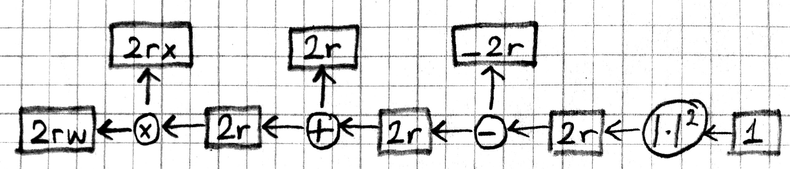
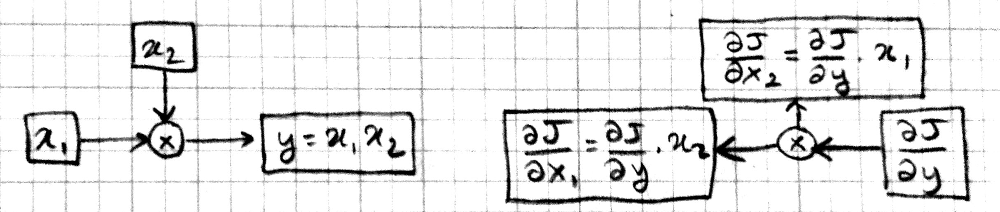

***************
Backpropagation
***************

.. note::

   **Concepts:** supervised learning, training data, regression,
   squared error, linear regression, stochastic gradient descent

Arthur Samuel, the author of the first self-learning checkers program,
defined machine learning as a "field of study that gives computers the
ability to learn without being explicitly programmed".  This leaves
the definition of learning a bit circular.  Tom M. Mitchell provided a
more formal definition: "A computer program is said to learn from
experience E with respect to some class of tasks T and performance
measure P if its performance at tasks in T, as measured by P, improves
with experience E," where the task, the experience, and the
performance measure are to be specified based on the problem.

We will start with **supervised learning**, where the task is to
predict the output of an unknown system given its input, and the
experience consists of a set of example input-output pairs, also known
as the **training data**.  When the outputs are numeric such problems
are called **regression**.  In **linear regression** we use a linear
function as our model:

.. math::

   \hat{y} = W x + b

Here :math:`x` is the model input, :math:`\hat{y}` is the model
output, :math:`W` is a matrix of weights, and :math:`b` is a vector of
biases.  By adjusting the parameters of this model, i.e. the weights
and the biases, we can make it compute any linear function of
:math:`x`.

"All models are wrong, but some models are useful." George Box
famously said.  We do not necessarily know that the system whose
output we are trying to predict is governed by a linear
relationship. All we know is a finite number of input-output examples:

.. math::

   \mathcal{D}=\{(x_1,y_1),\ldots,(x_N,y_N)\}

It is just that we have to start model building somewhere and the set
of all linear functions is a good place to start for now.

.. TODO: also mention somewhere the idea of basis functions

.. decide on a consistent set of index letters: inputs, outputs, instances
.. murphy uses N for instances, D for x dimensions
.. bishop uses D for x dims, M for phi dims, n=1:N for instances, K
.. for y dims for classification, (regression assumes 1 dim). we could
.. also use C, so the weight matrix is CxD.

A commonly used performance measure in regression problems is the
**squared error**, i.e. the average squared difference between the
actual output values and the ones predicted by the model.  So our goal
is to find model parameters that minimize the squared error:

.. math::

   \arg\min_{W,b} \frac{1}{N} \sum_{n=1}^N \| \hat{y}_n - y_n \|^2

Where :math:`\hat{y}_n = W x_n + b` denotes the output predicted by
the model for the :math:`n` th example.  

There are several methods to find the solution to the problem of
minimizing squared error.  Here we will present the **stochastic
gradient descent** (SGD) method because it generalizes well to more
complex models.  In SGD, we take the training examples one at a time
(or in small groups called minibatches), compute the gradient of the
parameters with respect to the error, and move the parameters a small
step in the direction that will decrease the error.  First some notes
on the math.

Partial derivatives
-------------------

When we have a function with several inputs and one output, we can
look at how the function value changes in response to a small change
in one of its inputs holding the rest fixed.  This is called a partial
derivative.  Let us consider the squared error for the :math:`n` th
input as an example:

.. math::

   J = \| W x_n + b - y_n \|^2

So the partial derivative :math:`\partial J / \partial w_{ij}` would
tell us how many units :math:`J` would move if we moved :math:`w_{ij}`
in :math:`W` one unit (at least for small enough units).  Here is a
more graphical representation:

.. image:: images/linregforw.jpg

In this figure, it is easier to see that the machinery that generates
:math:`J` has many "inputs".  In particular we can talk about how
:math:`J` is effected by changing parameters :math:`W` and :math:`b`,
as well as changing the input :math:`x`, the model output
:math:`\hat{y}`, the desired output :math:`y`, or intermediate values
like :math:`z` or :math:`r`.  So partial derivatives like
:math:`\partial J / \partial x_i` or :math:`\partial J / \partial
\hat{y}_j` are fair game and tell us how :math:`J` would react in
response to small changes in those quantities.

Chain rule
----------

The chain rule allows us to calculate partial derivatives in terms of
other partial derivatives, simplifying the overall computation.  We
will go over it in some detail as it forms the basis of the
backpropagation algorithm.  For now let us assume that each of the
variables in the above example are scalars.  We will start by looking
at the effect of :math:`r` on :math:`J` and move backward from there.
Basic calculus tells us that:

.. math::

   J = r^2 \\
   {\partial J}/{\partial r} = 2r

Thus, if :math:`r=5` and we decrease :math:`r` by a small
:math:`\epsilon`, the squared error :math:`J` will go down by
:math:`10\epsilon`.  Now let's move back a step and look at
:math:`\hat{y}`:

.. math::

   r = \hat{y} - y \\
   {\partial r}/{\partial \hat{y}} = 1

So how much effect will a small :math:`\epsilon` decrease in
:math:`\hat{y}` have on :math:`J` when :math:`r=5`?  Well, when
:math:`\hat{y}` goes down by :math:`\epsilon`, so will :math:`r`,
which means :math:`J` will go down by :math:`10\epsilon` again.  The
chain rule expresses this idea:

.. math::

   \frac{\partial J}{\partial\hat{y}} = 
   \frac{\partial J}{\partial r}
   \frac{\partial r}{\partial\hat{y}}
   = 2r

Going back further, we have:

.. math::

   \hat{y} = z + b \\
   {\partial \hat{y}}/{\partial b} = 1 \\
   {\partial \hat{y}}/{\partial z} = 1 \\

Which means :math:`b` and :math:`z` have the same effect on :math:`J`
as :math:`\hat{y}` and :math:`r`, i.e. decreasing them by
:math:`\epsilon` will decrease :math:`J` by :math:`2r\epsilon` as
well.  Finally:

.. math::

   z = w x \\
   {\partial z}/{\partial x} = w \\
   {\partial z}/{\partial w} = x

This allows us to compute the effect of :math:`w` on :math:`J` in
several steps: moving :math:`w` by :math:`\epsilon` will move
:math:`z` by :math:`x\epsilon`, :math:`\hat{y}` and :math:`r` will
move exactly the same amount because their partials with :math:`z` are
1, and finally since :math:`r` moves by :math:`x\epsilon`, :math:`J`
will move by :math:`2rx\epsilon`.

.. math::

   \frac{\partial J}{\partial w} =
   \frac{\partial J}{\partial r}
   \frac{\partial r}{\partial \hat{y}}
   \frac{\partial \hat{y}}{\partial z}
   \frac{\partial z}{\partial w}
   = 2rx

We can represent this process of computing partial derivatives as
follows:

Note that we have the same number of boxes and operations, but all the
arrows are reversed.  Let us call this the backward pass, and the
original computation in the previous picture the forward pass.  Each
box in this backward-pass picture represents the partial derivative
for the corresponding box in the previous forward-pass picture.  Most
importantly, each computation is local: each operation takes the
partial derivative of its output, and multiplies it with a factor that
only depends on the original input/output values to compute the
partial derivative of its input(s).  In fact we can implement the
forward and backward passes for the linear regression model using the
following local operations:

.. image:: images/sqnorm.jpg

.. image:: images/sub.jpg

.. image:: images/add.jpg

Multiple dimensions
-------------------

Let's look at the case where the input and output are not scalars but
vectors.  In particular assume that :math:`x \in \mathbb{R}^D` and
:math:`y \in \mathbb{R}^C`.  This makes :math:`W \in
\mathbb{R}^{C\times D}` a matrix and :math:`z,b,\hat{y},r` vectors in
:math:`\mathbb{R}^C`.  During the forward pass, :math:`z=Wx` operation
is now a matrix-vector product, the additions and subtractions are
elementwise operations.  The squared error :math:`J=\|r\|^2=\sum
r_i^2` is still a scalar.  For the backward pass we ask how much each
element of these vectors or matrices effect :math:`J`.  Starting with
:math:`r`:

.. math::

   J = \sum r_i^2 \\
   {\partial J}/{\partial r_i} = 2r_i

We see that when :math:`r` is a vector, the partial derivative of each
component is equal to twice that component.  If we put these partial
derivatives together in a vector, we obtain a **gradient** vector:

.. math::

   \nabla_r J
   \equiv \langle \frac{\partial J}{\partial r_1}, \cdots, \frac{\partial J}{\partial r_C} \rangle
   = \langle 2 r_1, \ldots, 2 r_C \rangle 
   = 2\vec{r}

The addition, subtraction, and square norm operations work the same
way as before except they act on each element.  Moving back through
the elementwise operations we see that:

.. math::

   \nabla_r J = \nabla_\hat{y} J = \nabla_b J = \nabla_z J = 2\vec{r}

For the operation :math:`z=Wx`, a little algebra will show you that:

.. math::

   \nabla_W J = \nabla_z J \cdot x^T \\
   \nabla_x J = W^T \cdot \nabla_z J

Note that the gradient of a variable has the same shape as the
variable itself.  In particular :math:`\nabla_W J` is a :math:`C\times
D` matrix.  Here is the graphical representation for matrix
multiplication:

.. image:: images/dot.jpg

Multiple instances
------------------

We will typically process data multiple instances at a time for
efficiency.  Thus, the input :math:`x` will be a :math:`D\times N`
matrix, and the output :math:`y` will be a :math:`C\times N` matrix,
the :math:`N` columns representing :math:`N` different instances.
Please verify to yourself that the forward and backward operations as
described above handle this case without much change: the elementwise
operations act on the elements of the matrices just like vectors, and
the matrix multiplication and its gradient remains the same.  Here is
a picture of the forward and backward passes:

.. image:: images/batchforwback.jpg

The only complication is at the addition of the bias vector.  In the
batch setting, we are adding :math:`b\in\mathbb{R}^{C\times 1}` to
:math:`z\in\mathbb{R}^{C\times N}`.  This will be a broadcasting
operation, i.e. the vector :math:`b` will be added to each column of
the matrix :math:`z` to get :math:`\hat{y}`.  In the backward pass,
we'll need to add the columns of :math:`\nabla_\hat{y} J` to get the
gradient :math:`\nabla_b J`.

.. TODO: is the Jacobian relevant here?

Gradients
---------

The gradient of a function with respect to a vector or matrix is not
only a collection of partial derivatives, but also the *direction of
maximum ascent*, i.e. if you are going to take a fixed size (small)
step, and you want the maximum increase in the function, you should
step in the direction of the gradient.  In our case, we want the
maximum *decrease* in the squared error function, so we should step in
the opposite direction of the gradient:

.. math::

   w \leftarrow w - \eta \nabla_w J

where :math:`w` is a parameter we want to optimize and :math:`\eta` is
a scalar that controls the step-size known as the learning rate.
Before we close this section we will consider several questions that
will be helpful when understanding more advanced optimization
techniques: Why is the gradient the direction of maximum ascent?  Are
there other directions that are guaranteed to increase or decrease the
objective function?  Are there times when we want to move in
directions other than the gradient?

