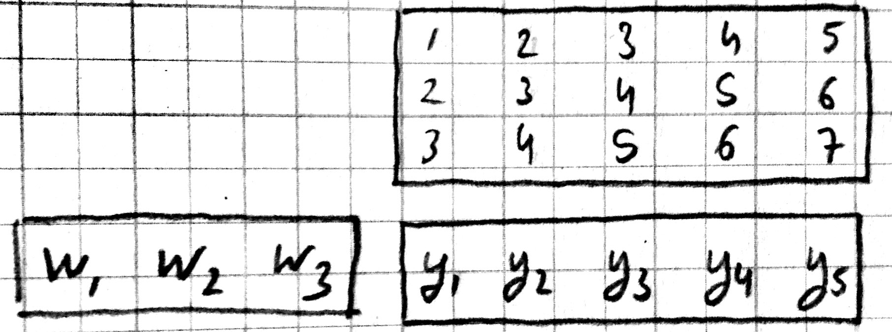
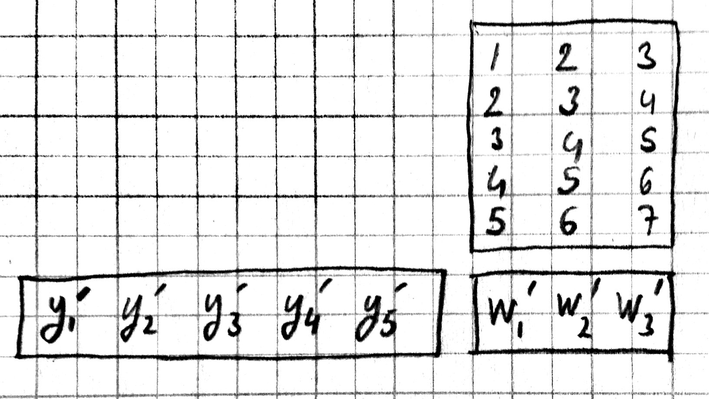

*****************************
Convolutional Neural Networks
*****************************

.. DONE: update all programming examples from Knet7 to Knet8

.. TODO: start with biological motivation, then rename the following
.. computational motivation.
.. http://www.deeplearningbook.org/contents/convnets.html has biological story in final sections.

.. emphasize viewpoint invariance (translational symmetry) from hinton:
.. https://d396qusza40orc.cloudfront.net/neuralnets/lecture_slides/lec5.pdf

.. receptive fields in deeper layers are larger:
.. http://www.deeplearningbook.org/contents/convnets.html Fig 9.4, pp. 339
.. this is true if we don't use pooling!

Motivation
----------

.. TODO: hinton mentions 2012 and 256x256 images, let's change to
.. ILSVRC-2012 when the revolution began.
..  https://d396qusza40orc.cloudfront.net/neuralnets/lecture_slides/lec5.pdf
.. nielsen also has some history on this:
.. http://neuralnetworksanddeeplearning.com/chap6.html

.. bengio has an edge detection net for efficiency comparison:
.. http://www.deeplearningbook.org/contents/convnets.html Fig 9.6 pp.342

.. invariance vs equivariance:
.. http://www.deeplearningbook.org/contents/convnets.html pp. 340
.. equivariant to translation but not rotation and scaling pp. 341

.. _ILSVRC: http://www.image-net.org/challenges/LSVRC/2014

Let's say we are trying to build a model that will detect cats in
photographs.  The average resolution of images in ILSVRC_ is
:math:`482\times 415`, with three channels (RGB) this makes the
typical input size :math:`482\times 415\times 3=600,090`.  Each hidden
unit connected to the input in a multilayer perceptron would have 600K
parameters, a single hidden layer of size 1000 would have 600 million
parameters.  Too many parameters cause two types of problems: (1)
today's GPUs have limited amount of memory (4G-12G) and large networks
fill them up quickly.  (2) models with a large number of parameters
are difficult to train without overfitting: we need a lot of data,
strong regularization, and/or a good initialization to learn with
large models.

One problem with the MLP is that it is fully connected: every hidden
unit is connected to every input pixel.  The model does not assume any
spatial relationships between pixels, in fact we can permute all the
pixels in an image and the performance of the MLP would be the same!
We could instead have an architecture where each hidden unit is
connected to a small patch of the image, say :math:`40\times 40`.
Each such locally connected hidden unit would have :math:`40\times
40\times 3=4800` parameters instead of 600K.  For the price (in
memory) of one fully connected hidden unit, we could have 125 of these
locally connected mini-hidden-units with receptive fields spread
around the image.

The second problem with the MLP is that it does not take advantage of
the symmetry in the problem: a cat in the lower right corner of the
image is going to be similar to a cat in the lower left corner.  This
means the local hidden units looking at these two patches can share
identical weights.  We can take one :math:`40\times 40` cat filter and
apply it to each :math:`40\times 40` patch in the image taking up only
4800 parameters.

.. TODO: add a picture of local vs fully connected.

A **convolutional neural network** (aka CNN or ConvNet) combines these
two ideas and uses operations that are local and that share weights.
CNNs commonly use three types of operations: convolution, pooling, and
normalization which we describe next.

Convolution
-----------

**Convolution in 1-D**

Let :math:`w, x` be two 1-D vectors with :math:`W, X` elements
respectively.  In our examples, we will assume x is the input
(consider it a 1-D image) and w is a filter (aka kernel) with
:math:`W<X`.  The 1-D convolution operation :math:`y=w\ast x` results
in a vector with :math:`Y=X-W+1` elements defined as:

.. math::

   y_k \equiv \sum_{i+j=k+W} x_i w_j

or equivalently

.. TODO: mention valid vs other types of convolution.
.. TODO: why flip?  the above expression derived from probability. flipping makes it commutative.

.. math::

   y_k \equiv \sum_{i=k}^{k+W-1} x_i w_{k+W-i}

where :math:`i\in[1,X], j\in[1,W], k\in[1,Y]`.  We get each entry in y
by multiplying pairs of matching entries in x and w and summing the
results.  Matching entries in x and w are the ones whose indices add
up to a constant.  This can be visualized as flipping w, sliding it
over x, and at each step writing their dot product into a single entry
in y.  Here is an example in Julia you should be able to calculate by
hand:

.. code::

   julia> w = KnetArray(reshape([1.0,2.0,3.0], (3,1,1,1)))
   3×1×1×1 Knet.KnetArray{Float64,4}: [1,2,3]
   julia> x = KnetArray(reshape([1.0:7.0...], (7,1,1,1)))
   7×1×1×1 Knet.KnetArray{Float64,4}: [1,2,3,4,5,6,7]
   julia> y = conv4(w, x)
   5×1×1×1 Knet.KnetArray{Float64,4}: [10,16,22,28,34]

.. _CUDNN: https://developer.nvidia.com/cudnn

``conv4`` is the convolution operation in Knet (based on the CUDNN_
implementation).  For reasons that will become clear it works with 4-D
and 5-D arrays, so we reshape our 1-D input vectors by adding extra
singleton dimensions at the end.  The convolution of w=[1,2,3] and
x=[1,2,3,4,5,6,7] gives y=[10,16,22,28,34].  For example, the third
element of y, 22, can be obtained by reversing w to [3,2,1] and taking
its dot product starting with the third element of x, [3,4,5].

**Padding**

In the last example, the input x had 7 dimensions, the output y had 5.
In image processing applications we typically want to keep x and y the
same size.  For this purpose we can provide a ``padding`` keyword
argument to the ``conv4`` operator.  If padding=k, x will be assumed
padded with k zeros on the left and right before the convolution,
e.g. padding=1 means treat x as [0 1 2 3 4 5 6 7 0].  The default
padding is 0.  For inputs in D-dimensions we can specify padding with
a D-tuple, e.g. ``padding=(1,2)`` for 2D, or a single number,
e.g. ``padding=1`` which is shorthand for ``padding=(1,1)``.  The
result will have :math:`Y=X+2P-W+1` elements where :math:`P` is the
padding size.  Therefore to preserve the size of x when W=3 we should
use padding=1.

.. code::

   julia> y = conv4(w, x; padding=(1,0))
   7×1×1×1 Knet.KnetArray{Float64,4}: [4,10,16,22,28,34,32]

.. TODO: implement actual 1-D convolution.

For example, to calculate the first entry of y, take the dot product
of the inverted w, [3,2,1] with the first three elements of the padded
x, [0 1 2].  You can see that in order to preserve the input size,
:math:`Y=X`, given a filter size :math:`W`, the padding should be set
to :math:`P=(W-1)/2`.  This will work if W is odd.

**Stride**

In the preceding examples we shift the inverted w by one position
after each dot product.  In some cases you may want to skip two or
more positions.  The amount of skip is set by the ``stride`` keyword
argument of the ``conv4`` operation (the default stride is 1).  In the
following example we set stride to W such that the consecutive filter
applications are non-overlapping:

.. code::

   julia> y = conv4(w, x; padding=(1,0), stride=3)
   3×1×1×1 Knet.KnetArray{Float64,4}: [4,22,32]

Note that the output has the first, middle, and last values of the
previous example, i.e. every third value is kept and the rest are
skipped.  In general if stride=S and padding=P, the size of the output
will be:

.. math::

   Y = 1 + \left\lfloor\frac{X+2P-W}{S}\right\rfloor

**Mode**

The convolution operation we have used so far flips the convolution
kernel before multiplying it with the input.  To take our first 1-D convolution example with 

.. math::

   y_1 &=& x_1 w_W + x_2 w_{W-1} + x_3 w_{W-2} + \ldots \\
   y_2 &=& x_2 w_W + x_3 w_{W-1} + x_4 w_{W-2} + \ldots \\
   \ldots

We could also perform a similar operation without kernel flipping:

.. math::

   y_1 &=& x_1 w_1 + x_2 w_2 + x_3 w_3 + \ldots \\
   y_2 &=& x_2 w_1 + x_3 w_2 + x_4 w_3 + \ldots \\
   \ldots

This variation is called cross-correlation.  The two modes are
specified in Knet by choosing one of the following as the
value of the ``mode`` keyword:

* ``0`` for convolution
* ``1`` for cross-correlation

This option would be important if we were hand designing our filters.
However the mode does not matter for CNNs where the filters are learnt
from data, the CNN will simply learn an inverted version of the filter
if necessary.

**More Dimensions**

When the input x has multiple dimensions convolution is defined
similarly.  In particular the filter w has the same number of
dimensions but typically smaller size.  The convolution operation
flips w in each dimension and slides it over x, calculating the sum of
elementwise products at every step.  The formulas we have given above
relating the output size to the input and filter sizes, padding and
stride parameters apply independently for each dimension.

Knet supports 2D and 3D convolutions.  The inputs and the filters have
two extra dimensions at the end which means we use 4D and 5D arrays
for 2D and 3D convolutions.  Here is a 2D convolution example:

.. code::

   julia> w = KnetArray(reshape([1.0:4.0...], (2,2,1,1)))
   2×2×1×1 Knet.KnetArray{Float64,4}:
   [:, :, 1, 1] =
    1.0  3.0
    2.0  4.0
   julia> x = KnetArray(reshape([1.0:9.0...], (3,3,1,1)))
   3×3×1×1 Knet.KnetArray{Float64,4}:
   [:, :, 1, 1] =
    1.0  4.0  7.0
    2.0  5.0  8.0
    3.0  6.0  9.0
   julia> y = conv4(w, x)
   2×2×1×1 Knet.KnetArray{Float64,4}:
   [:, :, 1, 1] =
    23.0  53.0
    33.0  63.0

To see how this result comes about, note that when you flip w in both
dimensions you get::

   4 2
   3 1

Multiplying this elementwise with the upper left corner of x::

   1 4
   2 5

and adding the results gives you the first entry 23.

The padding and stride options work similarly in multiple dimensions
and can be specified as tuples: padding=(1,2) means a padding width of
1 along the first dimension and 2 along the second dimension for a 2D
convolution.  You can use padding=1 as a shorthand for padding=(1,1).

**Multiple filters**

So far we have been ignoring the extra dimensions at the end of our
convolution arrays.  Now we are ready to put them to use.  A
D-dimensional input image is typically represented as a D+1
dimensional array with dimensions:

.. math::

   [ X_1, \ldots, X_D, C ]

The first D dimensions :math:`X_1\ldots X_D` determine the spatial
extent of the image.  The last dimension :math:`C` is the number of
channels (aka slices, frames, maps, filters).  The definition and
number of channels is application dependent.  We use C=3 for RGB
images representing the intensity in three colors: red, green, and
blue.  For grayscale images we have a single channel, C=1.  If you
were developing a model for chess, we could have C=12, each channel
representing the locations of a different piece type.

In an actual CNN we do not typically hand-code the filters.  Instead
we tell the network: "here are 1000 randomly initialized filters, you
go ahead and turn them into patterns useful for my task."  This means
we usually work with banks of multiple filters simultaneously and GPUs
have optimized operations for such filter banks.  The dimensions of a
typical filter bank are:

.. math::

   [ W_1, \ldots, W_D, I, O ]

The first D dimensions :math:`W_1\ldots W_D` determine the spatial
extent of the filters.  The next dimension :math:`I` is the number of
input channels, i.e. the number of filters from the previous layer, or
the number of color channels of the input image.  The last dimension
:math:`O` is the number of output channels, i.e. the number of filters
in this layer.

If we take an input of size :math:`[X_1,\ldots, X_D,I]` and apply a
filter bank of size :math:`[W_1,\ldots,W_D,I,O]` using padding
:math:`[P_1,\ldots,P_D]` and stride :math:`[S_1,\ldots,S_D]` the
resulting array will have dimensions:

.. math::

   [ W_1, \ldots, W_D, I, O ] \ast [ X_1, \ldots, X_D, I ] 
   \Rightarrow [ Y_1, \ldots, Y_D, O ] \\

   \mbox{where } Y_i = 1 + \left\lfloor\frac{X_i+2P_i-W_i}{S_i}\right\rfloor

As an example let's start with an input image of :math:`256\times 256`
pixels and 3 RGB channels.  We'll first apply 25 filters of size
:math:`5\times 5` and padding=2, then 50 filters of size
:math:`3\times 3` and padding=1, and finally 75 filters of size
:math:`3\times 3` and padding=1.  Here are the dimensions we will get:

.. math::

   [ 256, 256, 3 ] \ast [ 5, 5, 3, 25 ] \Rightarrow [ 256, 256, 25 ] \\
   [ 256, 256, 25] \ast [ 3, 3, 25,50 ] \Rightarrow [ 256, 256, 50 ] \\
   [ 256, 256, 50] \ast [ 3, 3, 50,75 ] \Rightarrow [ 256, 256, 75 ]

Note that the number of input channels of the input data and the
filter bank always match.  In other words, a filter covers only a
small part of the spatial extent of the input but all of its channel
depth.

**Multiple instances**

In addition to processing multiple filters in parallel, we will want
to implement CNNs with minibatching, i.e. process multiple inputs in
parallel.  A minibatch of D-dimensional images is represented as a D+2
dimensional array:

.. math::

   [ X_1, \ldots, X_D, I, N ]

where I is the number of channels as before, and N is the number of
images in a minibatch.  The convolution implementation in Knet/CUDNN
use D+2 dimensional arrays for both images and filters.  We used 1 for
the extra dimensions in our first examples, in effect using a single
channel and a single image minibatch.  

If we apply a filter bank of size :math:`[W_1, \ldots, W_D, I, O]` to
the minibatch given above the output size would be:

.. math::

   [ W_1, \ldots, W_D, I, O ] \ast [ X_1, \ldots, X_D, I, N ] 
   \Rightarrow [ Y_1, \ldots, Y_D, O, N ] \\

   \mbox{where } Y_i = 1 + \left\lfloor\frac{X_i+2P_i-W_i}{S_i}\right\rfloor

If we used a minibatch size of 128 in the previous example with
:math:`256\times 256` images, the sizes would be:

.. math::

   [ 256, 256, 3, 128 ] \ast [ 5, 5, 3, 25 ] \Rightarrow [ 256, 256, 25, 128 ] \\
   [ 256, 256, 25, 128] \ast [ 3, 3, 25,50 ] \Rightarrow [ 256, 256, 50, 128 ] \\
   [ 256, 256, 50, 128] \ast [ 3, 3, 50,75 ] \Rightarrow [ 256, 256, 75, 128 ]

basically adding an extra dimension of 128 at the end of each data
array.  

By the way, the arrays in this particular example already exceed 5GB
of storage, so you would want to use a smaller minibatch size if you
had a K20 GPU with 4GB of RAM.

Note: All the dimensions given above are for column-major languages
like Julia.  CUDNN uses row-major notation, so all the dimensions
would be reversed, e.g. :math:`[N,I,X_D,\ldots,X_1]`.

.. **Convolution vs neuron pictures**

.. http://colah.github.io/posts/2014-07-Understanding-Convolutions/

.. TODO: add beautiful pictures like the ones in http://colah.github.io/posts/2014-07-Conv-Nets-Modular/

.. the cbf operation is equivalent to applying f(wx+b) to each patch!

.. the output is sometimes called a feature map (http://www.deeplearningbook.org/contents/convnets.html)

**Convolution vs matrix multiplication**

.. http://www.deeplearningbook.org/contents/convnets.html pp.2
.. http://colah.github.io/posts/2014-07-Understanding-Convolutions
.. http://cs231n.github.io/convolutional-networks/ im2col

Convolution can be turned into a matrix multiplication, where certain
entries in the matrix are constrained to be the same.  The motivation
is to be able to use efficient algorithms for matrix multiplication
in order to perform convolution.  The drawback is the large amount of
memory needed due to repeated entries or sparse representations.

Here is a matrix implementation for our first convolution example
:math:`w=[1\ldots 3],\,\,x=[1\ldots 7],\,\,w\ast x = [10,16,22,28,34]`:

.. image:: images/im2col1a.jpg
   :width: 30%

In this example we repeated the entries of the filter on multiple rows
of a sparse matrix with shifted positions.  Alternatively we can
repeat the entries of the input to place each local patch on a
separate column of an input matrix:

.. image:: images/im2col1b.jpg
   :width: 50%

The first approach turns w into a :math:`Y\times X` sparse matrix,
wheras the second turns x into a :math:`W\times Y` dense matrix.

For 2-D images, typically the second approach is used: the local
patches of the image used by convolution are stretched out to columns
of an input matrix, an operation commonly called ``im2col``.  Each
convolutional filter is stretched out to rows of a filter matrix.
After the matrix multiplication the resulting array is reshaped into
the proper output dimensions.  The following figure illustrates these
operations on a small example:

.. image:: images/im2col2.jpg
   :width: 40%

It is also possible to go in the other direction, i.e. implement
matrix multiplication (i.e. a fully connected layer) in terms of
convolution.  This conversion is useful when we want to build a
network that can be applied to inputs of different sizes: the matrix
multiplication would fail, but the convolution will give us outputs of
matching sizes.  Consider a fully connected layer with a weight matrix
W of size :math:`K\times D` mapping a D-dimensional input vector x to
a K-dimensional output vector y.  We can consider each of the K rows
of the W matrix a convolution filter.  The following example shows how
we can reshape the arrays and use convolution for matrix
multiplication::
  
  julia> using Knet
  julia> x = KnetArray(reshape([1.0:3.0...], (3,1)))
  3×1 Knet.KnetArray{Float64,2}:
   1.0
   2.0
   3.0
  julia> w = KnetArray(reshape([1.0:6.0...], (2,3)))
  2×3 Knet.KnetArray{Float64,2}:
   1.0  3.0  5.0
   2.0  4.0  6.0
  julia> y = w * x
  2×1 Knet.KnetArray{Float64,2}:
   22.0
   28.0
  julia> x2 = reshape(x, (3,1,1,1))
  3×1×1×1 Knet.KnetArray{Float64,4}:
  [:, :, 1, 1] =
   1.0
   2.0
   3.0
  julia> w2 = KnetArray(reshape(Array(w)', (3,1,1,2)))
  3×1×1×2 Knet.KnetArray{Float64,4}:
  [:, :, 1, 1] =
   1.0
   3.0
   5.0
  [:, :, 1, 2] =
   2.0
   4.0
   6.0
  julia> y2 = conv4(w2, x2; mode=1)
  1×1×2×1 Knet.KnetArray{Float64,4}:
  [:, :, 1, 1] =
   22.0
  [:, :, 2, 1] =
   28.0
  
In addition to computational concerns, these examples also show that a
fully connected layer can emulate a convolutional layer given the
right weights and vice versa, i.e. convolution does not get us any
extra representational power.  However it does get us representational
and statistical efficiency, i.e. the functions we would like to
approximate are often expressed with significantly fewer parameters
using convolutional layers and thus require fewer examples to train.

.. DONE: It is also possible to convert FC to conv: http://cs231n.github.io/convolutional-networks/ Converting FC layers to CONV layers

**Backpropagation**

Convolution is a linear operation consisting of additions and
multiplications, so its backward pass is not very complicated except
for the indexing.  Just like the backward pass for matrix
multiplication can be expressed as another matrix multiplication, the
backward pass for convolution (at least if we use stride=1) can be
expressed as another convolution.  We will derive the backward pass
for a 1-D example using the cross-correlation mode (no kernel
flipping) to keep things simple.  We will denote the cross-correlation
operation with :math:`\star` to distinguish it from convolution
denoted with :math:`\ast`.  Here are the individual entries of
:math:`y=w\star x`:

.. TODO: confirm this at least if we use stride=1

.. math::

   y_1 &=& x_1 w_1 + x_2 w_2 + x_3 w_3 + \ldots \\
   y_2 &=& x_2 w_1 + x_3 w_2 + x_4 w_3 + \ldots \\
   y_3 &=& x_3 w_1 + x_4 w_2 + x_5 w_3 + \ldots \\
   \ldots

As you can see, because of weight sharing the same w entry is used in
computing multiple y entries.  This means a single w entry effects the
objective function through multiple paths and these effects need to be
added.  Denoting :math:`\partial J/\partial y_i` as :math:`y_i'` for
brevity we have:

.. math::

   w_1' &=& x_1 y_1' + x_2 y_2' + \ldots \\
   w_2' &=& x_2 y_1' + x_3 y_2' + \ldots \\
   w_3' &=& x_3 y_1' + x_4 y_2' + \ldots \\
   \ldots \\

which can be recognized as another cross-correlation operation, this
time between :math:`x` and :math:`y'`.  This allows us to write
:math:`w'=y'\star x`.

Alternatively, we can use the equivalent matrix multiplication
operation from the last section to derive the backward pass:

If :math:`r` is the matrix with repeated :math:`x` entries in this
picture, we have :math:`y=wr`. Remember that the backward pass for
matrix multiplication :math:`y=wr` is :math:`w'=y'r^T`:

which can be recognized as the matrix multiplication equivalent of the
cross correlation operation :math:`w'=y'\star x`.

Here is the gradient for the input:

.. math::

   x_1' &=& w_1 y_1' \\
   x_2' &=& w_2 y_1' + w_1 y_2' \\
   x_3' &=& w_3 y_1' + w_2 y_2' + w_1 y_3' \\
   \ldots \\

You can recognize this as a regular convolution between :math:`w` and
:math:`y'` with some zero padding.

The following resources provide more detailed derivations of the
backward pass for convolution:

* `Goodfellow, I. (2010) <http://www.iro.umontreal.ca/~lisa/pointeurs/convolution.pdf>`_. Technical report: Multidimensional, downsampled convolution for autoencoders. Technical report, Université de Montréal. 312.
* `Bouvrie, J. (2006) <http://people.csail.mit.edu/jvb/papers/cnn_tutorial.pdf>`_. Notes on convolutional neural networks.
* UFLDL `tutorial <http://ufldl.stanford.edu/tutorial/supervised/ConvolutionalNeuralNetwork>`_ and `exercise <http://ufldl.stanford.edu/tutorial/supervised/ExerciseConvolutionalNeuralNetwork>`_ on CNNs.

.. TODO: decide filter/kernel use consistently.

.. DONE: also derive using matrix multiplication.

.. hinton lec5 slide 11: mentions the weight tying and addition in back pass.
.. http://ufldl.stanford.edu/tutorial/supervised/ConvolutionalNeuralNetwork/ has derivatives
.. http://ufldl.stanford.edu/tutorial/supervised/ExerciseConvolutionalNeuralNetwork/ also
.. http://www.deeplearningbook.org/contents/convnets.html cites Goodfellow 2010 for derivatives.  says back pass implementable by conv only when stride=1.
.. See http://people.csail.mit.edu/jvb/papers/cnn_tutorial.pdf for a derivation of the backward pass for convolution.

Pooling
-------

.. computational motivation.
.. translational symmetry vs scale symmetry in viewpoint invariance.
.. pooling useful for ignoring small translations? or large scaling differences? (there is no weight tying for the second)
.. translation invariance (small shifts in input should not change the output) vs translational symmetry (same feature useful in one patch, also useful in another patch)
.. alternatives to pooling.

It is common practice to use pooling (aka subsampling) layers in
between convolution operations in CNNs.  Pooling looks at small
windows of the input, and computes a single summary statistic,
e.g. maximum or average, for each window.  A pooling layer basically
says: tell me whether this feature exists in a certain region of the
image, I don't care exactly where.  This makes the output of the layer
invariant to small translations of the input.  Pooling layers use
large strides, typically as large as the window size, which reduces
the size of their output.

.. This reduces memory cost and improves representational and statistical
.. efficiency when the function we want to represent can be approximated
.. well.

Like convolution, pooling slides a small window of a given size over
the input optionally padded with zeros skipping stride pixels every
step.  In Knet by default there is no padding, the window size is 2,
stride is equal to the window size and the pooling operation is max.
These default settings reduce each dimension of the input to half the
size.

**Pooling in 1-D**

Here is a 1-D example:

.. code::

   julia> x = KnetArray(reshape([1.0:6.0...], (6,1,1,1)))
   6×1×1×1 Knet.KnetArray{Float64,4}: [1,2,3,4,5,6]
   julia> pool(x)
   3×1×1×1 Knet.KnetArray{Float64,4}: [2,4,6]

With window size and stride equal to 2, pooling considers the input
windows :math:`[1,2], [3,4], [5,6]` and picks the maximum in each
window.  

**Window**

The default and most commonly used window size is 2, however other
window sizes can be specified using the ``window`` keyword.  For
D-dimensional inputs the size can be specified using a D-tuple,
e.g. ``window=(2,3)`` for 2-D, or a single number, e.g. ``window=3``
which is shorthand for ``window=(3,3)`` in 2-D.  Here is an example
using a window size of 3 instead of the default 2:

.. code::

  julia> x = KnetArray(reshape([1.0:6.0...], (6,1,1,1)))
  6×1×1×1 Knet.KnetArray{Float64,4}: [1,2,3,4,5,6]
  julia> pool(x; window=3)
  2×1×1×1 Knet.KnetArray{Float64,4}: [3, 6]
  
With a window and stride of 3 (the stride is equal to window size by
default), pooling considers the input windows :math:`[1,2,3],[4,5,6]`,
and writes the maximum of each window to the output.  If the input
size is :math:`X`, and stride is equal to the window size :math:`W`,
the output will have :math:`Y=\lfloor X/W\rfloor` elements.

**Padding**

The amount of zero padding is specified using the ``padding`` keyword
argument just like convolution.  Padding is 0 by default.  For
D-dimensional inputs padding can be specified as a tuple such as
``padding=(1,2)``, or a single number ``padding=1`` which is shorthand
for ``padding=(1,1)`` in 2-D.  Here is a 1-D example:

.. code::

  julia> x = KnetArray(reshape([1.0:6.0...], (6,1,1,1)))
  6×1×1×1 Knet.KnetArray{Float64,4}: [1,2,3,4,5,6]
  
  julia> pool(x; padding=(1,0))
  4×1×1×1 Knet.KnetArray{Float64,4}: [1,3,5,6]
  
In this example, window=stride=2 by default and the padding size is 1,
so the input is treated as :math:`[0,1,2,3,4,5,6,0]` and split into
windows of :math:`[0,1],[2,3],[4,5],[6,0]` and the maximum of each
window is written to the output.

With padding size :math:`P`, if the input size is :math:`X`, and
stride is equal to the window size :math:`W`, the output will have
:math:`Y=\lfloor (X+2P)/W\rfloor` elements.

**Stride**

The pooling stride is equal to the window size by default (as opposed
to the convolution case, where it is 1 by default).  This is most
common in practice but other strides can be specified using
tuples e.g. ``stride=(1,2)`` or numbers e.g. ``stride=1``. Here is a
1-D example with a stride of 4 instead of the default 2:

.. code::

  julia> x = KnetArray(reshape([1.0:10.0...], (10,1,1,1)))
  10×1×1×1 Knet.KnetArray{Float64,4}: [1,2,3,4,5,6,7,8,9,10]
  
  julia> pool(x; stride=4)
  4×1×1×1 Knet.KnetArray{Float64,4}: [2, 6, 10]

.. TODO: fix infersize problem when stride != window.

In general, when we have an input of size :math:`X` and pool with
window size :math:`W`, padding :math:`P`, and stride :math:`S`, the
size of the output will be:

.. math::

   Y = 1 + \left\lfloor\frac{X+2P-W}{S}\right\rfloor

**Pooling operations**

There are three pooling operations defined by CUDNN used for
summarizing each window:

* ``CUDNN_POOLING_MAX``
* ``CUDNN_POOLING_AVERAGE_COUNT_INCLUDE_PADDING``
* ``CUDNN_POOLING_AVERAGE_COUNT_EXCLUDE_PADDING``

These options can be specified as the value of the ``mode`` keyword
argument to the ``pool`` operation.  The default is
``0`` (max pooling) which we have been using so far.  The last two
compute averages, and differ in whether to include or exclude the
padding zeros in these averages.  ``mode`` should be ``1`` for averaging
including padding, and ``2`` for averaging excluding padding.
For example, with input :math:`x=[1,2,3,4,5,6]`, ``window=stride=2``,
and ``padding=1`` we have the following outputs with the three options::

  mode=0 => [1,3,5,6]
  mode=1 => [0.5, 2.5, 4.5, 3.0]
  mode=2 => [1.0, 2.5, 4.5, 6.0]

**More Dimensions**

D-dimensional inputs are pooled with D-dimensional windows, the size
of each output dimension given by the 1-D formulas above.  Here is a
2-D example with default options, i.e. window=stride=(2,2),
padding=(0,0), mode=max::
  
   julia> x = KnetArray(reshape([1.0:16.0...], (4,4,1,1)))
   4×4×1×1 Knet.KnetArray{Float64,4}:
   [:, :, 1, 1] =
    1.0  5.0   9.0  13.0
    2.0  6.0  10.0  14.0
    3.0  7.0  11.0  15.0
    4.0  8.0  12.0  16.0
   
   julia> pool(x)
   2×2×1×1 Knet.KnetArray{Float64,4}:
   [:, :, 1, 1] =
    6.0  14.0
    8.0  16.0
   

**Multiple channels and instances**

As we saw in convolution, each data array has two extra dimensions in
addition to the spatial dimensions: :math:`[ X_1, \ldots, X_D, I, N ]`
where :math:`I` is the number of channels and :math:`N` is the number
of instances in a minibatch.  

When the number of channels is greater than 1, the pooling operation
is performed independently on each channel, e.g. for each patch, the
maximum/average in each channel is computed independently and copied
to the output.  Here is an example with two channels::

  julia> x = KnetArray(rand(4,4,2,1))
  4×4×2×1 Knet.KnetArray{Float64,4}:
  [:, :, 1, 1] =
   0.880221  0.738729  0.317231   0.990521
   0.626842  0.562692  0.339969   0.92469
   0.416676  0.403625  0.352799   0.46624
   0.566254  0.634703  0.0632812  0.0857779
  
  [:, :, 2, 1] =
   0.300799  0.407623   0.26275   0.767884
   0.217025  0.0055375  0.623168  0.957374
   0.154975  0.246693   0.769524  0.628197
   0.259161  0.648074   0.333324  0.46305
  
  julia> pool(x)
  2×2×2×1 Knet.KnetArray{Float64,4}:
  [:, :, 1, 1] =
   0.880221  0.990521
   0.634703  0.46624
  
  [:, :, 2, 1] =
   0.407623  0.957374
   0.648074  0.769524
  
When the number of instances is greater than 1, i.e. we are using
minibatches, the pooling operation similarly runs in parallel on all
the instances::

  julia> x = KnetArray(rand(4,4,1,2))
  4×4×1×2 Knet.KnetArray{Float64,4}:
  [:, :, 1, 1] =
   0.155228  0.848345  0.629651  0.262436
   0.729994  0.320431  0.466628  0.0293943
   0.374592  0.662795  0.819015  0.974298
   0.421283  0.83866   0.385306  0.36081
  
  [:, :, 1, 2] =
   0.0562608  0.598084  0.0231604  0.232413
   0.71073    0.411324  0.28688    0.287947
   0.997445   0.618981  0.471971   0.684064
   0.902232   0.570232  0.190876   0.339076
  
  julia> pool(x)
  2×2×1×2 Knet.KnetArray{Float64,4}:
  [:, :, 1, 1] =
   0.848345  0.629651
   0.83866   0.974298
  
  [:, :, 1, 2] =
   0.71073   0.287947
   0.997445  0.684064

.. TODO: **Do we need pooling?**

.. TODO: **Backpropagation**

Normalization
-------------

Draft...

Karpathy says: "Many types of normalization layers have been proposed
for use in ConvNet architectures, sometimes with the intentions of
implementing inhibition schemes observed in the biological
brain. However, these layers have recently fallen out of favor because
in practice their contribution has been shown to be minimal, if any."
(http://cs231n.github.io/convolutional-networks/#norm)  Batch
normalization may be an exception, as it is used in modern
architectures.

Here are some references for normalization operations:

Implementations:

* Alex Krizhevsky's cuda-convnet library API. (https://code.google.com/archive/p/cuda-convnet/wikis/LayerParams.wiki#Local_response_normalization_layer_(same_map))
* http://caffe.berkeleyvision.org/tutorial/layers.html
* http://lasagne.readthedocs.org/en/latest/modules/layers/normalization.html

Divisive normalisation (DivN):

* S. Lyu and E. Simoncelli. Nonlinear image representation
  using divisive normalization. In CVPR, pages 1–8, 2008.

Local contrast normalization (LCN):

* N. Pinto, D. D. Cox, and J. J. DiCarlo. Why is real-world visual
  object recognition hard? PLoS Computational Biology,
  4(1), 2008.
* Jarrett, Kevin, et al. "What is the best multi-stage architecture
  for object recognition?." Computer Vision, 2009 IEEE 12th
  International Conference
  on. IEEE, 2009. (http://yann.lecun.com/exdb/publis/pdf/jarrett-iccv-09.pdf)

Local response normalization (LRN):

* Krizhevsky, Alex, Ilya Sutskever, and Geoffrey E. Hinton. "Imagenet
  classification with deep convolutional neural networks." Advances in
  neural information processing systems. 2012. 
  (http://machinelearning.wustl.edu/mlpapers/paper_files/NIPS2012_0534.pdf)

Batch Normalization: This is more of an optimization topic.

* Ioffe, Sergey, and Christian Szegedy. "Batch normalization:
  Accelerating deep network training by reducing internal covariate
  shift." arXiv preprint arXiv:1502.03167 (2015). (http://arxiv.org/abs/1502.03167/)

.. TODO: LCN, LRN, DivN, BatchNormalization, 
.. TODO: what is Inception? It seems like they are trying to determine the connectivity pattern automatically.

.. References from Saman for Normalization
.. LRN 
.. http://www.cs.toronto.edu/~fritz/absps/imagenet.pdf

.. DivNorm
.. https://code.google.com/archive/p/cuda-convnet/wikis/LayerParams.wiki#Local_response_normalization_layer_(same_map)
.. This is equivalent to Local Contrast Normalization of Cuda-convnet in the link given. 

.. LeCunn’s Formulation of LCN (not there in cudnn)
.. http://yann.lecun.com/exdb/publis/pdf/jarrett-iccv-09.pdf

.. Batch Normalization
.. http://arxiv.org/pdf/1502.03167.pdf
.. I have not test the batch normalization so far.

Architectures
-------------

We have seen a number of new operations: convolution, pooling, filters
etc.  How to best put these together to form a CNN is still an active
area of research.  In this section we summarize common patterns of
usage in recent work based on `(Karpathy, 2016)
<http://cs231n.github.io/convolutional-networks>`_.

* The operations in convolutional networks are usually ordered into
  several layers of convolution-bias-activation-pooling sequences.
  Note that the convolution-bias-activation sequence is an efficient way
  to implement the common neural net function :math:`f(wx+b)` for a
  locally connected and weight sharing hidden layer.  

* The convolutional layers are typically followed by a number of fully
  connected layers that end with a softmax layer for prediction (if we
  are training for a classification problem).

* It is preferrable to have multiple convolution layers with small
  filter sizes rather than a single layer with a large filter size.
  Consider three convolutional layers with a filter size of
  :math:`3\times 3`.  The units in the top layer have receptive fields
  of size :math:`7\times 7`.  Compare this with a single layer with a
  filter size of :math:`7\times 7`.  The three layer architecture has
  two advantages: The units in the single layer network is restricted
  to linear decision boundaries, whereas the three layer network can
  be more expressive.  Second, if we assume C channels, the parameter
  tensor for the single layer network has size :math:`[7,7,C,C]`
  whereas the three layer network has three tensors of size
  :math:`[3,3,C,C]` i.e. a smaller number of parameters.  The one
  disadvantage of the three layer network is the extra storage
  required to store the intermediate results for backpropagation.

* Thus common settings for convolution use :math:`3\times 3` filters
  with ``stride = padding = 1`` (which incidentally preserves the
  input size).  The one exception may be a larger filter size used in
  the first layer which is applied to the image pixels.  This will
  save memory when the input is at its largest, and linear functions
  may be sufficient to express the low level features at this stage.

* The pooling operation may not be present in every layer.  Keep in
  mind that pooling destroys information and having several
  convolutional layers without pooling may allow more complex features
  to be learnt.  When pooling is present it is best to keep the window
  size small to minimize information loss.  The common settings for
  pooling are ``window = stride = 2, padding = 0``, which halves the
  input size in each dimension.

Beyond these general guidelines, you should look at the architectures
used by successful models in the literature.  Some examples are 
LeNet `(LeCun et al. 1998) <http://yann.lecun.com/exdb/publis/pdf/lecun-98.pdf>`_,
AlexNet `(Krizhevsky et al. 2012) <http://papers.nips.cc/paper/4824-imagenet-classification-with-deep-convolutional-neural-networks>`_,
ZFNet `(Zeiler and Fergus, 2013) <http://arxiv.org/abs/1311.2901>`_,
GoogLeNet `(Szegedy et al. 2014) <http://arxiv.org/abs/1409.4842>`_,
VGGNet `(Simonyan and Zisserman, 2014) <http://arxiv.org/abs/1409.1556>`_, and 
ResNet `(He et al. 2015) <http://arxiv.org/abs/1512.03385>`_.

.. architecture of individual units:
.. http://colah.github.io/posts/2014-07-Conv-Nets-Modular/
.. claims a conv unit is a single layer mlp? and a natural extension
.. would be multi layer:
.. "That said, in the recent paper ‘Network in Network’ (Lin et
.. al. (2013)), a new “Mlpconv” layer is proposed. In this model, AA
.. would have multiple layers of neurons, with the final layer outputting
.. higher level features for the region. In the paper, the model achieves
.. some very impressive results, setting new state of the art on a number
.. of benchmark datasets."

Exercises
---------

* Design a filter that shifts a given image one pixel to right.
* Design an image filter that has 0 output in regions of uniform
  color, but nonzero output at edges where the color changes.
* If your input consisted of two consecutive frames of video, how
  would you detect motion using convolution?
* Can you implement matrix-vector multiplication in terms of convolution?
  How about matrix-matrix multiplication?  Do you need reshape operations?  
* Can you implement convolution in terms of matrix multiplication?
* Can you implement elementwise broadcasting multiplication in terms
  of convolution?

References
----------

* Some of this chapter was based on the excellent lecture notes from: http://cs231n.github.io/convolutional-networks
* Christopher Olah's blog has very good visual explanations (thanks to 
  Melike Softa for the reference): http://colah.github.io/posts/2014-07-Conv-Nets-Modular
* `UFLDL <http://ufldl.stanford.edu>`_ 
  (or its `old version
  <http://ufldl.stanford.edu/wiki/index.php/UFLDL_Tutorial>`_)
  is an online tutorial with programming examples and explicit gradient derivations covering
  `convolution <http://ufldl.stanford.edu/tutorial/supervised/FeatureExtractionUsingConvolution>`_, 
  `pooling <http://ufldl.stanford.edu/tutorial/supervised/Pooling>`_, 
  and `CNNs <http://ufldl.stanford.edu/tutorial/supervised/ConvolutionalNeuralNetwork>`_.
* Hinton's video lecture and presentation at Coursera (Lec 5): https://d396qusza40orc.cloudfront.net/neuralnets/lecture_slides/lec5.pdf
* For a derivation of gradients see: http://people.csail.mit.edu/jvb/papers/cnn_tutorial.pdf or http://www.iro.umontreal.ca/~lisa/pointeurs/convolution.pdf
* The CUDNN manual has more details about the convolution API: https://developer.nvidia.com/cudnn
* http://deeplearning.net/tutorial/lenet.html
* http://www.denizyuret.com/2014/04/on-emergence-of-visual-cortex-receptive.html
* http://neuralnetworksanddeeplearning.com/chap6.html
* http://www.deeplearningbook.org/contents/convnets.html
* http://www.wildml.com/2015/11/understanding-convolutional-neural-networks-for-nlp
* http://scs.ryerson.ca/~aharley/vis/conv/ has a nice visualization of an MNIST CNN.  (Thanks to Fatih Ozhamaratli for the reference).
* http://josephpcohen.com/w/visualizing-cnn-architectures-side-by-side-with-mxnet visualizing popular CNN architectures side by side with mxnet.
* http://cs231n.github.io/understanding-cnn visualizing what convnets learn.
* https://arxiv.org/abs/1603.07285 A guide to convolution arithmetic for deep learning

.. TODO: checkout https://www.udacity.com/course/deep-learning--ud730

.. TODO: mention the main motivation behind cnns, the visual cortex story.

.. TODO: separate programming examples from math?

.. TODO: add references at the end of each section.

.. discuss efficiency, reducing parameters reduces learning complexity
.. even though mlp is universal, learning weights for a cat-recognizer
.. would end up repeating weights.

.. karpathy says fully connected would have too many params and that
.. would lead to overfitting.  I think the problem is not overfitting,
.. an architecture that does the same job with fewer parameters can
.. learn from fewer examples and generalize better.  It would be a
.. better prior.  Maybe that is overfitting.  Can we do a simple
.. example with polynomials?  Theory from Bayes or SLT?

.. If detecting a horizontal edge is important at some location in the
.. image, it should intuitively be useful at some other location as
.. well due to the translationally-invariant structure of
.. images. There is therefore no need to relearn to detect a
.. horizontal edge at every one of the 55*55 distinct locations in the
.. Conv layer output volume.

.. TODO: theory lectures on Bayes (MacKay 21), SLT (PAC, VC dims), Regret
.. (Shalev-Schwartz), mistake bounds (perceptron).

.. the neurons in a layer will only be connected to a small region of
.. the layer before it, instead of all of the neurons in a
.. fully-connected manner.

.. Every filter is small spatially (along width and height), but
.. extends through the full depth of the input volume.

.. karpathy calls the 3rd dimension "depth".  This is a mistake, it
.. will get confusing when we get to 3D convolution.  It is better to
.. call this dimension "channels" or "filters" or "slices".

.. two explanations: the "each neuron connected to a small region" vs
.. convolution as a filter that scans the image.  The first ignores
.. the fact that the neurons also share weights.  Filter is better.
.. Still maybe give both pictures, the matrix/filter picture and the
.. neural network picture.  Here is a quote for correspondence:

.. Every entry in the output volume can thus also be interpreted as an
.. output of a neuron that looks at only a small region in the input
.. and shares parameters with neurons in the same activation map
.. (since these numbers all result from applying the same filter).

.. talking about 3D instead of 4D ignoring the minibatching at first
.. is better?  But the conv weights still have to be 4D.  Still, the
.. volume of activations is a nice picture.

.. talk about (1) dimensions thru ops, and (2) hyperparameters of
.. ops. (3) connectivities.

.. Do we describe backprop? for conv, pool, normalization?
.. The backward pass for a convolution operation (for both the data
.. and the weights) is also a convolution (but with spatially-flipped
.. filters). This is easy to derive in the 1-dimensional case with a
.. toy example (not expanded on for now).

.. hyperparameters control the size of the output volume: the depth,
.. stride and zero-padding.

.. We will refer to a set of neurons that are all looking at the same
.. region of the input as a depth column.

.. It is also nice to give 1D convolution examples.

.. normalization?  karpathy says they have fallen out of favor?  For
.. various types of normalizations, see the discussion in Alex
.. Krizhevsky's cuda-convnet library API.

.. add knet examples to this and other sections.

.. .. during backpropagation, every neuron in the volume will compute the
.. .. gradient for its weights, but these gradients will be added up
.. .. across each depth slice and only update a single set of weights per
.. .. slice.

.. .. kernel is another name for filter?

.. .. nice im2col explanation and conv demo, missing backprop example.

.. .. also expressing certain outputs with regular matmul with the
.. .. correct indexing is useful.

.. .. It is worth noting that there are only two commonly seen variations
.. .. of the max pooling layer found in practice: A pooling layer with
.. .. F=3,S=2F=3,S=2 (also called overlapping pooling), and more commonly
.. .. F=2,S=2F=2,S=2. Pooling sizes with larger receptive fields are too
.. .. destructive.

.. ..  In addition to max pooling, the pooling units can also perform
.. .. other functions, such as average pooling or even L2-norm
.. .. pooling. Average pooling was often used historically but has
.. .. recently fallen out of favor compared to the max pooling operation,
.. .. which has been shown to work better in practice.

.. .. Pooling: Notice that the volume depth is preserved.

.. .. backprop for max pooling is easy, got to keep track of where max
.. .. is. what to do if more than one max?

.. .. Recent developments.

.. Fractional Max-Pooling suggests a method for performing the pooling
.. operation with filters smaller than 2x2. This is done by randomly
.. generating pooling regions with a combination of 1x1, 1x2, 2x1 or 2x2
.. filters to tile the input activation map. The grids are generated
.. randomly on each forward pass, and at test time the predictions can be
.. averaged across several grids.
.. Striving for Simplicity: The All Convolutional Net proposes to discard
.. the pooling layer in favor of architecture that only consists of
.. repeated CONV layers. To reduce the size of the representation they
.. suggest using larger stride in CONV layer once in a while.
.. Due to the aggressive reduction in the size of the representation
.. (which is helpful only for smaller datasets to control overfitting),
.. the trend in the literature is towards discarding the pooling layer in
.. modern ConvNets.

.. It is worth noting that the only difference between FC and CONV
.. layers is that the neurons in the CONV layer are connected only to
.. a local region in the input, and that many of the neurons in a CONV
.. volume share parameters. 

.. fc->conv and conv->fc is interesting.
.. fc->conv has the advantage of using the whole net as a local filter
.. on a larger image!

.. Evaluating the original ConvNet (with FC layers) independently
.. across 224x224 crops of the 384x384 image in strides of 32 pixels
.. gives an identical result to forwarding the converted ConvNet one
.. time.

.. Another trick:
.. Lastly, what if we wanted to efficiently apply the original ConvNet
.. over the image but at a stride smaller than 32 pixels? We could
.. achieve this with multiple forward passes. For example, note that
.. if we wanted to use a stride of 16 pixels we could do so by
.. combining the volumes received by forwarding the converted ConvNet
.. twice: First over the original image and second over the image but
.. with the image shifted spatially by 16 pixels along both width and
.. height.

.. TODO: Inception module?

.. TODO: Batch normalization?

.. TODO: overfitting lecture: model size, early stop, good init,
.. regularization, bayes, dropout... need some theory.

.. TODO: optimization lecture: adam, rmsprop, adagrad... need some
.. theory.

.. TODO: knet and exercises.
