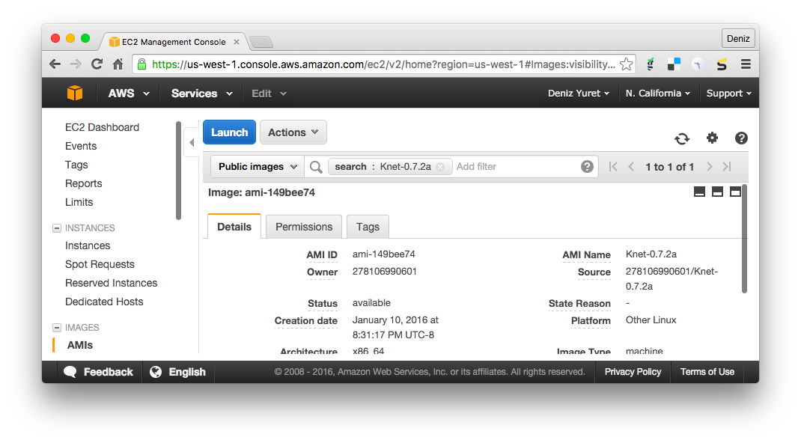
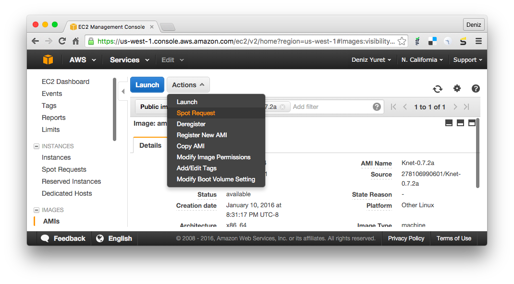
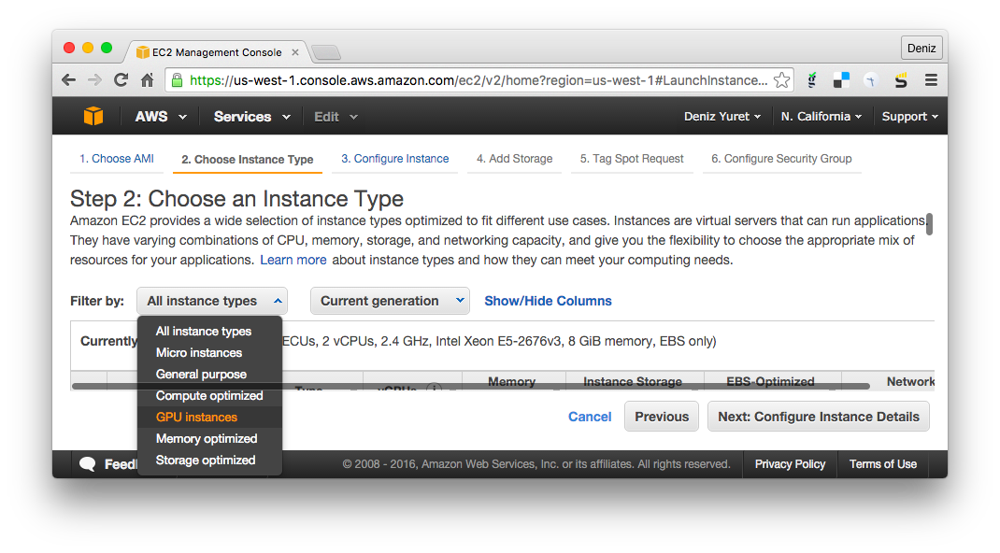
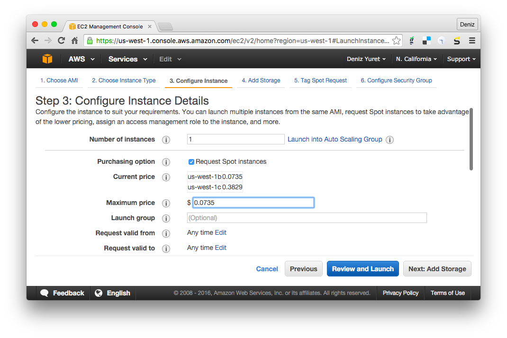
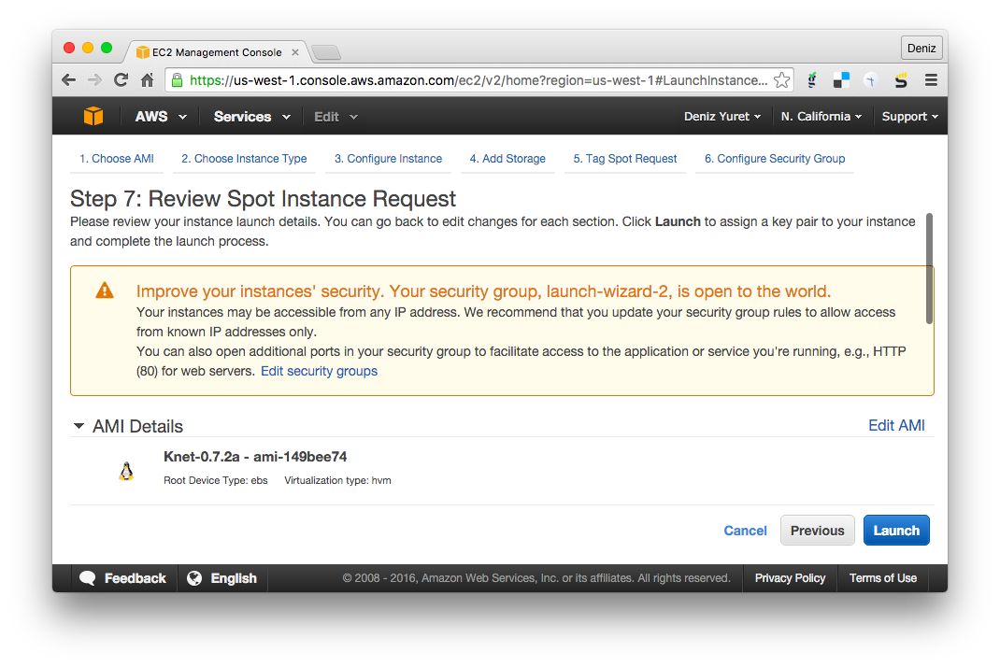
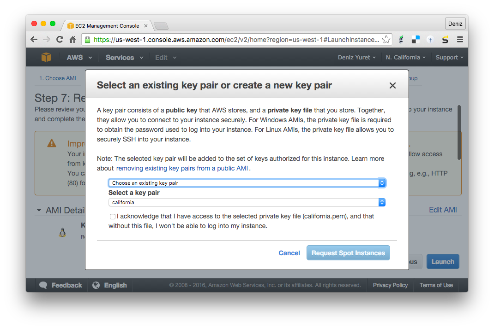
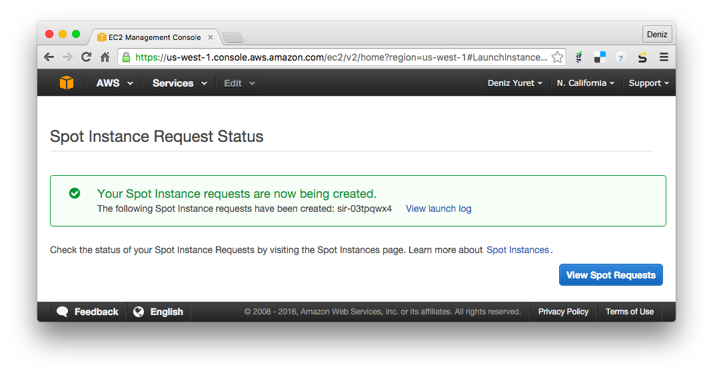
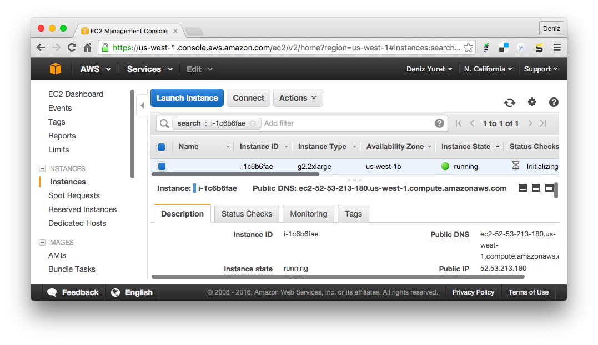

***************
Setting up Knet
***************

.. _GitHub issue: https://github.com/denizyuret/Knet.jl/issues
.. _knet-users: https://groups.google.com/forum/#!forum/knet-users

Knet is a machine learning module implemented in Julia, so you should
be able to run it on any machine that can run Julia.  It has been
extensively tested on Linux machines with NVIDIA GPUs and CUDA
libraries, but most of it works on vanilla Linux and OSX machines as
well (currently cpu-only support for some operations is incomplete).
If you would like to try it on your own computer, please follow the
instructions on `Installation`_.  If you would like to try working
with a GPU and do not have access to one, take a look at `Using Amazon
AWS`_.  If you find a bug, please open a `GitHub issue`_.  If you
would like to contribute to Knet, see `Tips for developers`_.  If you
need help, or would like to request a feature, please consider joining
the knet-users_ mailing list.

Installation
------------

First download and install the latest version of Julia from
`<http://julialang.org/downloads>`_.  As of this writing the latest
version is 0.4.2 and I have tested Knet using 64-bit Generic Linux
binaries and the Mac OS X package (dmg).  Once Julia is installed,
type ``julia`` at the command prompt to start the Julia interpreter.
To install Knet type
``Pkg.clone("git://github.com/denizyuret/Knet.jl.git")`` and go get
some coffee while Julia downloads and installs all the necessary
packages::

    $ julia
                   _
       _       _ _(_)_     |  A fresh approach to technical computing
      (_)     | (_) (_)    |  Documentation: http://docs.julialang.org
       _ _   _| |_  __ _   |  Type "?help" for help.
      | | | | | | |/ _` |  |
      | | |_| | | | (_| |  |  Version 0.4.2 (2015-12-06 21:47 UTC)
     _/ |\__'_|_|_|\__'_|  |  Official http://julialang.org/ release
    |__/                   |  x86_64-apple-darwin13.4.0
    
    julia> Pkg.clone("git://github.com/denizyuret/Knet.jl.git")

If you have a GPU machine, you may need to type ``Pkg.build("Knet")``
to compile the Knet GPU kernels.  If you do not have a GPU machine,
you don't need ``Pkg.build`` but you may get some warnings indicating
the lack of GPU support.  Usually, these can be safely ignored.  To
make sure everything has installed correctly, type
``Pkg.test("Knet")`` which should take a couple of minutes kicking the
tires.  If all is OK, continue with the next section, if not you can
get help at the knet-users_ mailing list.

Tips for developers
-------------------

Knet is an open-source project and we are always open to new
contributions: bug fixes, new machine learning models and operators,
inspiring examples, benchmarking results are all welcome.  If you'd
like to contribute to the code base, here are some tips:

* Please get an account at `github.com <https://www.github.com>`_.
* `Fork <https://help.github.com/articles/fork-a-repo>`_ the `Knet repository <https://github.com/denizyuret/Knet.jl>`_.
* Point Julia to your fork using ``Pkg.clone("git@github.com:your-username/Knet.jl.git")`` and ``Pkg.build("Knet")``.  You may want to remove any old versions with ``Pkg.rm("Knet")`` first.
* Make sure your `fork is up-to-date <https://help.github.com/articles/syncing-a-fork>`_.
* Retrieve the latest version of the master branch using ``Pkg.checkout("Knet")``.
* Test your code using ``Pkg.test("Knet")``.
* Please submit your contribution using a `pull request <https://help.github.com/articles/using-pull-requests>`_.

Using Amazon AWS
----------------

.. _Amazon Web Services: https://aws.amazon.com
.. _AMI: http://docs.aws.amazon.com/AWSEC2/latest/UserGuide/AMIs.html

If you don't have access to a GPU machine, but would like to
experiment with one, `Amazon Web Services`_ is a possible solution.  I
have prepared a machine image (AMI_) with everything you need to run
Knet.  At the time of this writing you can get a GPU instance for 7.5
cents an hour with a spot request.  Here are step by step instructions
for launching a GPU instance with a Knet image:

.. _Setting Up with Amazon EC2: https://docs.aws.amazon.com/AWSEC2/latest/UserGuide/get-set-up-for-amazon-ec2.html

First, you need to sign up and create an account following the
instructions on `Setting Up with Amazon EC2`_.  Once you have an
account, open the Amazon EC2 console at
https://console.aws.amazon.com/ec2 and login.  You should see the
following screen:

.. image:: images/aws01.png

Make sure you select the "N. California" region in the upper right
corner, then click on AMIs on the left menu.  Choose "Public images"
and enter "Knet" in the AMI search box.  Pick the latest Knet image
(Knet-0.7.2d as of this writing).  You should see the following screen
with information about the Knet AMI:

From the "Actions" pull-down menu, choose "Spot Request":

You should see the "Step 2: Choose and Instance Type" page.  Next to
"Filter by:" change "All instance types" to "GPU instances".

This should reduce the number of instance types displayed to a few.
Pick the "g2.2xlarge" instance and click on "Next: Configure Instance
Details":

.. image:: images/aws05.png

This should take you to the "Step 3: Configure Instance Details" page.
Make sure "Number of instances" is 1, "Request Spot instances" is
selected, and enter your "Maximum price" which you can pick based on
the "Current price" displayed.  Click "Review and Launch".

This should take you to the "Step 7: Review Spot Instance Request"
page. You can just click "Launch" here:

You should see the "key pair" pop up menu.  In order to login to your
instance, you need an ssh key pair.  If you have created a pair during
the initial setup you can use it with "Choose an existing key pair":

Otherwise pick "Create a new key pair" from the pull down menu, enter
a name for it, and click "Download Key Pair".  Make sure you keep the
downloaded file, we will use it to login.

.. image:: images/aws09.png

After making sure you have the key file (it has a .pem extension),
click "Request Spot Instances" in the lower right.  We have completed
the request.  You should see the "Spot Instance Request Status" page.
Click on "View Spot Requests":

You should see your request with a status of "pending-evaluation".
This should change into "fulfilled" in a couple of minutes.  If not,
the status may become "price-too-low", in which case you may want to
increase your price a bit going through the above steps again:

.. image:: images/aws11.png

Once your request status is "fulfilled", click on the instance-id
under the "Instance" column.  This will take you to the "Instances"
screen:

You should see the address of your instance where it says something
like "Public DNS: ec2-52-53-213-180.us-west-1.compute.amazonaws.com".
Open up a terminal (or Putty if you are on Windows) and type::

    ssh -i knetkey.pem ec2-user@ec2-52-53-213-180.us-west-1.compute.amazonaws.com

Replacing ``knetkey.pem`` with the path to your key file and
``ec2-52-53-213-180`` with the address of your machine.  If all goes
well you should get a shell prompt.  There you can type ``julia``, and
at the julia prompt ``Pkg.update()`` and ``Pkg.build("Knet")`` to get
the latest versions of the packages, as the versions in the AMI may be
out of date::

    [ec2-user@ip-172-31-6-90 ~]$ julia
		   _
       _       _ _(_)_     |  A fresh approach to technical computing
      (_)     | (_) (_)    |  Documentation: http://docs.julialang.org
       _ _   _| |_  __ _   |  Type "?help" for help.
      | | | | | | |/ _` |  |
      | | |_| | | | (_| |  |  Version 0.4.2 (2015-12-06 21:47 UTC)
     _/ |\__'_|_|_|\__'_|  |  Official http://julialang.org/ release
    |__/                   |  x86_64-unknown-linux-gnu

    WARNING: Terminal not fully functional
    julia> Pkg.update()
    julia> Pkg.build("Knet")

Finally you can run ``Pkg.test("Knet")`` to make sure all is good.
This should take about a minute.  If all tests pass, you are ready to
work with Knet::

    julia> Pkg.test("Knet")
    INFO: Testing Knet
    INFO: Simple linear regression example
    ...
    INFO: Knet tests passed

    julia> 

