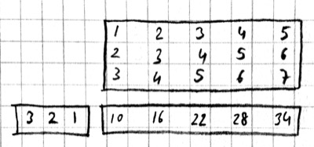

# Convolutional Neural Networks

## Motivation

Let's say we are trying to build a model that will detect cats in
photographs. The average resolution of images in
[ILSVRC](http://www.image-net.org/challenges/LSVRC/2014) is 482x415,
with three channels (RGB) this makes the typical input size
482x415x3=600,090. Each hidden unit connected to the input in a
multilayer perceptron would have 600K parameters, a single hidden
layer of size 1000 would have 600 million parameters. Too many
parameters cause three types of problems: (1) runtime: large models
are computationally costly to train and run. (2) memory: today's GPUs
have limited amount of memory (4G-12G) and large networks fill them up
quickly. (3) sample complexity: models with a large number of
parameters are difficult to train without overfitting: we need a lot
of data, strong regularization, and/or a good initialization to learn
with large models.

One problem with the MLP is that it is fully connected: every hidden
unit is connected to every other in adjacent layers. The model does
not assume any spatial relationships between pixels, in fact we can
permute all the pixels in an image and the performance of the MLP
would be the same!  We could instead have an architecture where each
hidden unit is connected to a small patch of the image, say
40x40. Each such locally connected hidden unit would have 40x40x3=4800
parameters instead of 600K. For the price (in memory) of one fully
connected hidden unit (600K), we could have 125 of these locally
connected mini-hidden-units (4800 each) with receptive fields spread
around the image.

The second problem with the MLP is that it does not take advantage of
the symmetry in the problem: a cat in the lower right corner of the
image may be similar to a cat in the upper left corner. This means the
local hidden units looking at these two patches can share the same
weights. We can take one 40x40 cat filter and apply it to each 40x40
patch in the image taking up only 4800 parameters.

A **convolutional neural network** (aka CNN or ConvNet) combines these
two ideas and uses operations that are local and that share weights.
CNNs commonly use three types of operations: [convolution](@ref
Convolution), [pooling](@ref Pooling), and [normalization](@ref
Normalization) which we describe next.

## Convolution

Convolution is the main operation that provides sparse connectivity
and weight sharing.  For simplicity we start describing [convolution
in 1-D](@ref conv_1d) using the [`conv4`](@ref) primitive from Knet.
We next look at three keyword options that provide variations on the
convolution operation: [`padding`](@ref conv_padding), [`stride`](@ref
conv_stride), and [`mode`](@ref conv_mode).  We then describe how
`conv4` handles [multiple dimensions](@ref conv_dims), [filters](@ref
conv_filters), and [instances](@ref conv_instances) in parallel.

The relationship between convolution and [matrix multiplication](@ref
conv_matmul) allows the use of efficient algorithms developed for
matrix multiplication in convolution implementations.  The fact that
convolution and matrix multiplication can be implemented in terms of
each other clarifies the distinction between CNNs and MLPs as one of
efficiency, not representative power.  We end this section by
describing [backpropagation](@ref conv_backprop) for convolution.

### [Convolution in 1-D](@id conv_1d)

Let ``w, x`` be two 1-D vectors with ``W, X`` elements
respectively. In our examples, we will assume ``x`` is the input
(consider it a 1-D image) and ``w`` is a filter (aka kernel) with
``W<X``. The 1-D convolution operation ``y=w\ast x`` results in a
vector with ``Y=X-W+1`` elements defined as:

```math
y_k \equiv \sum_{i+j=k+W} x_i w_j
```

or equivalently

```math
y_k \equiv \sum_{i=k}^{k+W-1} x_i w_{k+W-i}
```

where ``i\in[1,X], j\in[1,W], k\in[1,Y]``. We get each entry in y by
multiplying pairs of matching entries in x and w and summing the
results. Matching entries in x and w are the ones whose indices add up
to a constant. This can be visualized as flipping w, sliding it over x,
and at each step writing their dot product into a single entry in y.
Here is an example in Julia you should be able to calculate by hand:

```julia
julia> using Knet
julia> w = reshape([1.0,2.0,3.0], (3,1,1,1))
3×1×1×1 Array{Float64,4}: [1,2,3]
julia> x = reshape([1.0:7.0...], (7,1,1,1))
7×1×1×1 Array{Float64,4}: [1,2,3,4,5,6,7]
julia> y = conv4(w, x)
5×1×1×1 Array{Float64,4}: [10,16,22,28,34]
```

`conv4` is the convolution operation in Knet (based on the
[CUDNN](https://developer.nvidia.com/cudnn) implementation). For
reasons that will become clear it works with 4-D and 5-D arrays, so we
reshape our 1-D input vectors by adding extra singleton dimensions at
the end.  The convolution of `w=[1,2,3]` and `x=[1,2,3,4,5,6,7]` gives
`y=[10,16,22,28,34]`. For example, the third element of y, 22, can be
obtained by reversing w to [3,2,1] and taking its dot product starting
with the third element of x, [3,4,5].

### [Padding](@id conv_padding)

In the last example, the input x had 7 dimensions, the output y had 5.
In image processing applications we typically want to keep x and y the
same size. For this purpose we can provide a `padding` keyword
argument to the `conv4` operator. If `padding=k`, x will be assumed
padded with `k` zeros on the left and right before the convolution,
e.g. `padding=1` means treat x as `[0 1 2 3 4 5 6 7 0]`. The default
padding is 0. For inputs in D-dimensions we can specify padding with a
D-tuple, e.g. `padding=(1,2)` for 2D, or a single number,
e.g. `padding=1` which is shorthand for `padding=(1,1)`. The result
will have ``Y=X+2P-W+1`` elements where ``P`` is the padding
size. Therefore to preserve the size of x when W=3 we should use
`padding=1`.

```julia
julia> y = conv4(w, x; padding=(1,0))
7×1×1×1 Array{Float64,4}: [4,10,16,22,28,34,32]
```

For example, to calculate the first entry of y, take the dot product
of the inverted w, `[3,2,1]` with the first three elements of the
padded x, `[0 1 2]`. You can see that in order to preserve the input
size, ``Y=X``, given a filter size ``W``, the padding should be set to
``P=(W-1)/2``. This will work if ``W`` is odd.

### [Stride](@id conv_stride)

In the preceding examples we shift the inverted w by one position
after each dot product. In some cases you may want to skip two or more
positions. This will effectively reduce the size of the output.  The
amount of skip is set by the `stride` keyword argument of the `conv4`
operation (the default stride is 1). In the following example we set
stride to ``W`` such that the consecutive filter applications are
non-overlapping:

```julia
julia> y = conv4(w, x; padding=(1,0), stride=3)
3×1×1×1 Array{Float64,4}: [4,22,32]
```

Note that the output has the first, middle, and last values of the
previous example, i.e. every third value is kept and the rest are
skipped. In general if `stride=S` and `padding=P`, the size of the
output will be:

```math
Y = 1 + \left\lfloor\frac{X+2P-W}{S}\right\rfloor
```

### [Mode](@id conv_mode)

The convolution operation we have used so far flips the convolution
kernel before multiplying it with the input. To take our first 1-D
convolution example with

```math
y_1 = x_1 w_W + x_2 w_{W-1} + x_3 w_{W-2} + \ldots \\
y_2 = x_2 w_W + x_3 w_{W-1} + x_4 w_{W-2} + \ldots \\
\ldots
```

We could also perform a similar operation without kernel flipping:

```math
y_1 = x_1 w_1 + x_2 w_2 + x_3 w_3 + \ldots \\
y_2 = x_2 w_1 + x_3 w_2 + x_4 w_3 + \ldots \\
\ldots
```

This variation is called cross-correlation. The two modes are specified
in Knet by choosing one of the following as the value of the `mode`
keyword:

-   `0` for convolution
-   `1` for cross-correlation

This option would be important if we were hand designing our filters.
However the mode does not matter for CNNs where the filters are learnt
from data, the CNN will simply learn an inverted version of the filter
if necessary.

### [More Dimensions](@id conv_dims)

When the input x has multiple dimensions convolution is defined
similarly. In particular the filter w has the same number of dimensions
but typically smaller size. The convolution operation flips w in each
dimension and slides it over x, calculating the sum of elementwise
products at every step. The formulas we have given above relating the
output size to the input and filter sizes, padding and stride parameters
apply independently for each dimension.

Knet supports 2D and 3D convolutions. The inputs and the filters have
two extra dimensions at the end which means we use 4D and 5D arrays for
2D and 3D convolutions. Here is a 2D convolution example:

```julia
julia> w = reshape([1.0:4.0...], (2,2,1,1))
2×2×1×1 Array{Float64,4}:
[:, :, 1, 1] =
 1.0  3.0
 2.0  4.0
julia> x = reshape([1.0:9.0...], (3,3,1,1))
3×3×1×1 Array{Float64,4}:
[:, :, 1, 1] =
 1.0  4.0  7.0
 2.0  5.0  8.0
 3.0  6.0  9.0
julia> y = conv4(w, x)
2×2×1×1 Array{Float64,4}:
[:, :, 1, 1] =
 23.0  53.0
 33.0  63.0
```

To see how this result comes about, note that when you flip w in both
dimensions you get:

    4 2
    3 1

Multiplying this elementwise with the upper left corner of x:

    1 4
    2 5

and adding the results gives you the first entry 23.

The `padding` and `stride` options work similarly in multiple
dimensions and can be specified as tuples: `padding=(1,2)` means a
padding width of 1 along the first dimension and 2 along the second
dimension for a 2D convolution. You can use `padding=1` as a shorthand
for `padding=(1,1)`.

### [Multiple filters](@id conv_filters)

So far we have been ignoring the extra dimensions at the end of our
convolution arrays. Now we are ready to put them to use. A D-dimensional
input image is typically represented as a D+1 dimensional array with
dimensions:

```math
[ X_1, \ldots, X_D, C_x ]
```

The first D dimensions ``X_1\ldots X_D`` determine the spatial extent
of the image. The last dimension ``C_x`` is the number of channels
(aka slices, frames, maps, filters). The definition and number of
channels is application dependent. We use ``C_x=3`` for RGB images
representing the intensity in three colors: red, green, and blue. For
grayscale images we have a single channel, ``C_x=1``. If you were
developing a model for chess, we could have ``C_x=12``, each channel
representing the locations of a different piece type.

In an actual CNN we do not typically hand-code the filters. Instead we
tell the network: "here are 1000 randomly initialized filters, you go
ahead and turn them into patterns useful for my task." This means we
usually work with banks of multiple filters simultaneously and GPUs
have optimized operations for such filter banks. The dimensions of a
typical filter bank are:

```math
[ W_1, \ldots, W_D, C_x, C_y ]
```

The first D dimensions ``W_1\ldots W_D`` determine the spatial extent
of the filters. The next dimension ``C_x`` is the number of input
channels, i.e. the number of filters from the previous layer, or the
number of color channels of the input image. The last dimension
``C_y`` is the number of output channels, i.e. the number of filters
in this layer.

If we take an input of size ``[X_1,\ldots, X_D,C_x]`` and apply a filter
bank of size ``[W_1,\ldots,W_D,C_x,C_y]`` using padding ``[P_1,\ldots,P_D]`` and
stride ``[S_1,\ldots,S_D]`` the resulting array will have dimensions:

```math
[ W_1, \ldots, W_D, C_x, C_y ] \ast [ X_1, \ldots, X_D, C_x ] 
\Rightarrow [ Y_1, \ldots, Y_D, C_y ] \\
\mathrm{where } Y_i = 1 + \left\lfloor\frac{X_i+2P_i-W_i}{S_i}\right\rfloor
```

As an example let's start with an input image of 256x256 pixels and 3
RGB channels. We'll first apply 25 filters of size 5x5 and
`padding=2`, then 50 filters of size 3x3 and `padding=1`, and finally
75 filters of size 3x3 and `padding=1`. Here are the dimensions we
will get:

```math
[ 256, 256, 3 ] \ast [ 5, 5, 3, 25 ] \Rightarrow [ 256, 256, 25 ] \\
[ 256, 256, 25] \ast [ 3, 3, 25,50 ] \Rightarrow [ 256, 256, 50 ] \\
[ 256, 256, 50] \ast [ 3, 3, 50,75 ] \Rightarrow [ 256, 256, 75 ]
```

Note that the number of input channels of the input data and the filter
bank always match. In other words, a filter covers only a small part of
the spatial extent of the input but all of its channel depth.

### [Multiple instances](@id conv_instances)

In addition to processing multiple filters in parallel, we implement
CNNs with minibatching, i.e. process multiple inputs in parallel to
fully utilize GPUs. A minibatch of D-dimensional images is represented
as a D+2 dimensional array:

```math
[ X_1, \ldots, X_D, C_x, N ]
```

where ``C_x`` is the number of channels as before, and N is the number
of images in a minibatch. The convolution implementation in Knet/CUDNN
use ``D+2`` dimensional arrays for both images and filters. We used 1
for the extra dimensions in our first examples, in effect using a
single channel and a single image minibatch.

If we apply a filter bank of size ``[W_1, \ldots, W_D, C_x, C_y]`` to the
minibatch given above the output size would be:

```math
[ W_1, \ldots, W_D, C_x, C_y ] \ast [ X_1, \ldots, X_D, C_x, N ] 
\Rightarrow [ Y_1, \ldots, Y_D, C_y, N ] \\
\mathrm{where } Y_i = 1 + \left\lfloor\frac{X_i+2P_i-W_i}{S_i}\right\rfloor
```

If we used a minibatch size of 128 in the previous example with
256x256 images, the sizes would be:

```math
[ 256, 256, 3, 128 ] \ast [ 5, 5, 3, 25 ] \Rightarrow [ 256, 256, 25, 128 ] \\
[ 256, 256, 25, 128] \ast [ 3, 3, 25,50 ] \Rightarrow [ 256, 256, 50, 128 ] \\
[ 256, 256, 50, 128] \ast [ 3, 3, 50,75 ] \Rightarrow [ 256, 256, 75, 128 ]
```

basically adding an extra dimension of 128 at the end of each data
array.

By the way, the arrays in this particular example already exceed 5GB of
storage, so you would want to use a smaller minibatch size if you had a
K20 GPU with 4GB of RAM.

Note: All the dimensions given above are for column-major languages like
Julia. CUDNN uses row-major notation, so all the dimensions would be
reversed, e.g. ``[N,C_x,X_D,\ldots,X_1]``.

### [Convolution vs matrix multiplication](@id conv_matmul)

Convolution can be turned into a matrix multiplication, where certain
entries in the matrix are constrained to be the same. The motivation is
to be able to use efficient algorithms for matrix multiplication in
order to perform convolution. The drawback is the large amount of memory
needed due to repeated entries or sparse representations.

Here is a matrix implementation for our first convolution example
``w=[1\ldots 3],\,\,x=[1\ldots 7],\,\,w\ast x = [10,16,22,28,34]``:

> 

In this example we repeated the entries of the filter on multiple rows
of a sparse matrix with shifted positions. Alternatively we can repeat
the entries of the input to place each local patch on a separate column
of an input matrix:

> 

The first approach turns w into a ``Y\times X`` sparse matrix, wheras the
second turns x into a ``W\times Y`` dense matrix.

For 2-D images, typically the second approach is used: the local patches
of the image used by convolution are stretched out to columns of an
input matrix, an operation commonly called `im2col`. Each convolutional
filter is stretched out to rows of a filter matrix. After the matrix
multiplication the resulting array is reshaped into the proper output
dimensions. The following figure illustrates these operations on a small
example:

> 

It is also possible to go in the other direction, i.e. implement matrix
multiplication (i.e. a fully connected layer) in terms of convolution.
This conversion is useful when we want to build a network that can be
applied to inputs of different sizes: the matrix multiplication would
fail, but the convolution will give us outputs of matching sizes.
Consider a fully connected layer with a weight matrix W of size
``K\times D`` mapping a D-dimensional input vector x to a K-dimensional
output vector y. We can consider each of the K rows of the W matrix a
convolution filter. The following example shows how we can reshape the
arrays and use convolution for matrix multiplication:

```julia
julia> using Knet
julia> x = reshape([1.0:3.0...], (3,1))
3×1 Array{Float64,2}:
 1.0
 2.0
 3.0
julia> w = reshape([1.0:6.0...], (2,3))
2×3 Array{Float64,2}:
 1.0  3.0  5.0
 2.0  4.0  6.0
julia> y = w * x
2×1 Array{Float64,2}:
 22.0
 28.0
julia> x2 = reshape(x, (3,1,1,1))
3×1×1×1 Array{Float64,4}:
[:, :, 1, 1] =
 1.0
 2.0
 3.0
julia> w2 = reshape(Array(w)', (3,1,1,2))
3×1×1×2 Array{Float64,4}:
[:, :, 1, 1] =
 1.0
 3.0
 5.0
[:, :, 1, 2] =
 2.0
 4.0
 6.0
julia> y2 = conv4(w2, x2; mode=1)
1×1×2×1 Array{Float64,4}:
[:, :, 1, 1] =
 22.0
[:, :, 2, 1] =
 28.0
```

In addition to computational concerns, these examples also show that a
fully connected layer can emulate a convolutional layer given the right
weights and vice versa, i.e. convolution does not get us any extra
representational power. However it does get us representational and
statistical efficiency, i.e. the functions we would like to approximate
are often expressed with significantly fewer parameters using
convolutional layers and thus require fewer examples to train.

### [Backpropagation](@id conv_backprop)

Convolution is a linear operation consisting of additions and
multiplications, so its backward pass is not very complicated except for
the indexing. Just like the backward pass for matrix multiplication can
be expressed as another matrix multiplication, the backward pass for
convolution (at least if we use stride=1) can be expressed as another
convolution. We will derive the backward pass for a 1-D example using
the cross-correlation mode (no kernel flipping) to keep things simple.
We will denote the cross-correlation operation with ``\star`` to
distinguish it from convolution denoted with ``\ast``. Here are the
individual entries of ``y=w\star x``:

```math
y_1 = x_1 w_1 + x_2 w_2 + x_3 w_3 + \ldots \\
y_2 = x_2 w_1 + x_3 w_2 + x_4 w_3 + \ldots \\
y_3 = x_3 w_1 + x_4 w_2 + x_5 w_3 + \ldots \\
\ldots
```

As you can see, because of weight sharing the same w entry is used in
computing multiple y entries. This means a single w entry effects the
objective function through multiple paths and these effects need to be
added. Denoting ``\partial J/\partial y_i`` as ``y_i'`` for brevity we have:

```math
w_1' = x_1 y_1' + x_2 y_2' + \ldots \\
w_2' = x_2 y_1' + x_3 y_2' + \ldots \\
w_3' = x_3 y_1' + x_4 y_2' + \ldots \\
\ldots \\
```

which can be recognized as another cross-correlation operation, this
time between ``x`` and ``y'``. This allows us to write ``w'=y'\star x``.

Alternatively, we can use the equivalent matrix multiplication operation
from the last section to derive the backward pass:

> 

If ``r`` is the matrix with repeated ``x`` entries in this picture, we have
``y=wr``. Remember that the backward pass for matrix multiplication ``y=wr``
is ``w'=y'r^T``:

> 

which can be recognized as the matrix multiplication equivalent of the
cross correlation operation ``w'=y'\star x``.

Here is the gradient for the input:

```math
\begin{aligned}
& x_1' = w_1 y_1' \\
& x_2' = w_2 y_1' + w_1 y_2' \\
& x_3' = w_3 y_1' + w_2 y_2' + w_1 y_3' \\
& \ldots
\end{aligned}
```

You can recognize this as a regular convolution between ``w`` and ``y'``
with some zero padding.

The following resources provide more detailed derivations of the
backward pass for convolution:

-   [Goodfellow, I.
    (2010)](http://www.iro.umontreal.ca/~lisa/pointeurs/convolution.pdf).
    Technical report: Multidimensional, downsampled convolution for
    autoencoders. Technical report, Université de Montréal. 312.
-   [Bouvrie, J.
    (2006)](http://people.csail.mit.edu/jvb/papers/cnn_tutorial.pdf).
    Notes on convolutional neural networks.
-   UFLDL
    [tutorial](http://ufldl.stanford.edu/tutorial/supervised/ConvolutionalNeuralNetwork)
    and
    [exercise](http://ufldl.stanford.edu/tutorial/supervised/ExerciseConvolutionalNeuralNetwork)
    on CNNs.

## Pooling

It is common practice to use pooling (aka subsampling) layers in between
convolution operations in CNNs. Pooling looks at small windows of the
input, and computes a single summary statistic, e.g. maximum or average,
for each window. A pooling layer basically says: tell me whether this
feature exists in a certain region of the image, I don't care exactly
where. This makes the output of the layer invariant to small
translations of the input. Pooling layers use large strides, typically
as large as the window size, which reduces the size of their output.

Like convolution, pooling slides a small window of a given size over the
input optionally padded with zeros skipping stride pixels every step. In
Knet by default there is no padding, the window size is 2, stride is
equal to the window size and the pooling operation is max. These default
settings reduce each dimension of the input to half the size.

### [Pooling in 1-D](@id pool_1d)

Here is a 1-D example:

```julia
julia> x = reshape([1.0:6.0...], (6,1,1,1))
6×1×1×1 Array{Float64,4}: [1,2,3,4,5,6]
julia> pool(x)
3×1×1×1 Array{Float64,4}: [2,4,6]
```

With window size and stride equal to 2, pooling considers the input
windows ``[1,2], [3,4], [5,6]`` and picks the maximum in each window.

### [Window](@id pool_window)

The default and most commonly used window size is 2, however other
window sizes can be specified using the `window` keyword. For
D-dimensional inputs the size can be specified using a D-tuple, e.g.
`window=(2,3)` for 2-D, or a single number, e.g. `window=3` which is
shorthand for `window=(3,3)` in 2-D. Here is an example using a window
size of 3 instead of the default 2:

```julia
julia> x = reshape([1.0:6.0...], (6,1,1,1))
6×1×1×1 Array{Float64,4}: [1,2,3,4,5,6]
julia> pool(x; window=3)
2×1×1×1 Array{Float64,4}: [3, 6]
```

With a window and stride of 3 (the stride is equal to window size by
default), pooling considers the input windows ``[1,2,3],[4,5,6]``, and
writes the maximum of each window to the output. If the input size is
``X``, and stride is equal to the window size ``W``, the output will have
``Y=\lfloor X/W\rfloor`` elements.

### [Padding](@id pool_padding)

The amount of zero padding is specified using the `padding` keyword
argument just like convolution. Padding is 0 by default. For
D-dimensional inputs padding can be specified as a tuple such as
`padding=(1,2)`, or a single number `padding=1` which is shorthand for
`padding=(1,1)` in 2-D. Here is a 1-D example:

```julia
julia> x = reshape([1.0:6.0...], (6,1,1,1))
6×1×1×1 Array{Float64,4}: [1,2,3,4,5,6]

julia> pool(x; padding=(1,0))
4×1×1×1 Array{Float64,4}: [1,3,5,6]
```

In this example, window=stride=2 by default and the padding size is 1,
so the input is treated as ``[0,1,2,3,4,5,6,0]`` and split into windows of
``[0,1],[2,3],[4,5],[6,0]`` and the maximum of each window is written to
the output.

With padding size ``P``, if the input size is ``X``, and stride is equal to
the window size ``W``, the output will have ``Y=\lfloor (X+2P)/W\rfloor``
elements.

### [Stride](@id pool_stride)

The pooling stride is equal to the window size by default (as opposed to
the convolution case, where it is 1 by default). This is most common in
practice but other strides can be specified using tuples e.g.
`stride=(1,2)` or numbers e.g. `stride=1`. Here is a 1-D example with a
stride of 4 instead of the default 2:

```julia
julia> x = reshape([1.0:10.0...], (10,1,1,1))
10×1×1×1 Array{Float64,4}: [1,2,3,4,5,6,7,8,9,10]

julia> pool(x; stride=4)
4×1×1×1 Array{Float64,4}: [2, 6, 10]
```

In general, when we have an input of size ``X`` and pool with window size
``W``, padding ``P``, and stride ``S``, the size of the output will be:

```math
Y = 1 + \left\lfloor\frac{X+2P-W}{S}\right\rfloor
```

### [Mode](@id pool_mode)

There are three pooling operations defined by CUDNN used for summarizing
each window:

-   `CUDNN_POOLING_MAX`
-   `CUDNN_POOLING_AVERAGE_COUNT_INCLUDE_PADDING`
-   `CUDNN_POOLING_AVERAGE_COUNT_EXCLUDE_PADDING`

These options can be specified as the value of the `mode` keyword
argument to the `pool` operation. The default is `0` (max pooling) which
we have been using so far. The last two compute averages, and differ in
whether to include or exclude the padding zeros in these averages.
`mode` should be `1` for averaging including padding, and `2` for
averaging excluding padding. For example, with input ``x=[1,2,3,4,5,6]``,
`window=stride=2`, and `padding=1` we have the following outputs with
the three options:

    mode=0 => [1,3,5,6]
    mode=1 => [0.5, 2.5, 4.5, 3.0]
    mode=2 => [1.0, 2.5, 4.5, 6.0]

### [More Dimensions](@id pool_dims)

D-dimensional inputs are pooled with D-dimensional windows, the size of
each output dimension given by the 1-D formulas above. Here is a 2-D
example with default options, i.e. window=stride=(2,2), padding=(0,0),
mode=max:

```julia
julia> x = reshape([1.0:16.0...], (4,4,1,1))
4×4×1×1 Array{Float64,4}:
[:, :, 1, 1] =
 1.0  5.0   9.0  13.0
 2.0  6.0  10.0  14.0
 3.0  7.0  11.0  15.0
 4.0  8.0  12.0  16.0

julia> pool(x)
2×2×1×1 Array{Float64,4}:
[:, :, 1, 1] =
 6.0  14.0
 8.0  16.0
```

### [Multiple channels and instances](@id pool_instances)

As we saw in convolution, each data array has two extra dimensions in
addition to the spatial dimensions: ``[ X_1, \ldots, X_D, C_x, N ]`` where
``C_x`` is the number of channels and ``N`` is the number of instances in a
minibatch.

When the number of channels is greater than 1, the pooling operation is
performed independently on each channel, e.g. for each patch, the
maximum/average in each channel is computed independently and copied to
the output. Here is an example with two channels:

```julia
julia> x = rand(4,4,2,1)
4×4×2×1 Array{Float64,4}:
[:, :, 1, 1] =
 0.880221  0.738729  0.317231   0.990521
 0.626842  0.562692  0.339969   0.92469
 0.416676  0.403625  0.352799   0.46624
 0.566254  0.634703  0.0632812  0.0857779

[:, :, 2, 1] =
 0.300799  0.407623   0.26275   0.767884
 0.217025  0.0055375  0.623168  0.957374
 0.154975  0.246693   0.769524  0.628197
 0.259161  0.648074   0.333324  0.46305

julia> pool(x)
2×2×2×1 Array{Float64,4}:
[:, :, 1, 1] =
 0.880221  0.990521
 0.634703  0.46624

[:, :, 2, 1] =
 0.407623  0.957374
 0.648074  0.769524
```

When the number of instances is greater than 1, i.e. we are using
minibatches, the pooling operation similarly runs in parallel on all the
instances:

```julia
julia> x = rand(4,4,1,2)
4×4×1×2 Array{Float64,4}:
[:, :, 1, 1] =
 0.155228  0.848345  0.629651  0.262436
 0.729994  0.320431  0.466628  0.0293943
 0.374592  0.662795  0.819015  0.974298
 0.421283  0.83866   0.385306  0.36081

[:, :, 1, 2] =
 0.0562608  0.598084  0.0231604  0.232413
 0.71073    0.411324  0.28688    0.287947
 0.997445   0.618981  0.471971   0.684064
 0.902232   0.570232  0.190876   0.339076

julia> pool(x)
2×2×1×2 Array{Float64,4}:
[:, :, 1, 1] =
 0.848345  0.629651
 0.83866   0.974298

[:, :, 1, 2] =
 0.71073   0.287947
 0.997445  0.684064
```

## Normalization

Draft...

Karpathy says: "Many types of normalization layers have been proposed
for use in ConvNet architectures, sometimes with the intentions of
implementing inhibition schemes observed in the biological brain.
However, these layers have recently fallen out of favor because in
practice their contribution has been shown to be minimal, if any."
([http://cs231n.github.io/convolutional-networks/#norm](http://cs231n.github.io/convolutional-networks/#norm)) Batch
normalization may be an exception, as it is used in modern
architectures.

Here are some references for normalization operations:

Implementations:

-   Alex Krizhevsky's cuda-convnet library API.
    ([https://code.google.com/archive/p/cuda-convnet/wikis/LayerParams.wiki#Local_response_normalization_layer_(same_map)](https://code.google.com/archive/p/cuda-convnet/wikis/LayerParams.wiki#Local_response_normalization_layer_(same_map)))
-   [http://caffe.berkeleyvision.org/tutorial/layers.html](http://caffe.berkeleyvision.org/tutorial/layers.html)
-   [http://lasagne.readthedocs.org/en/latest/modules/layers/normalization.html](http://lasagne.readthedocs.org/en/latest/modules/layers/normalization.html)

Divisive normalisation (DivN):

-   S. Lyu and E. Simoncelli. Nonlinear image representation using
    divisive normalization. In CVPR, pages 1–8, 2008.

Local contrast normalization (LCN):

-   N. Pinto, D. D. Cox, and J. J. DiCarlo. Why is real-world visual
    object recognition hard? PLoS Computational Biology, 4(1), 2008.
-   Jarrett, Kevin, et al. "What is the best multi-stage architecture
    for object recognition?." Computer Vision, 2009 IEEE 12th
    International Conference on. IEEE, 2009.
    ([http://yann.lecun.com/exdb/publis/pdf/jarrett-iccv-09.pdf](http://yann.lecun.com/exdb/publis/pdf/jarrett-iccv-09.pdf))

Local response normalization (LRN):

-   Krizhevsky, Alex, Ilya Sutskever, and Geoffrey E. Hinton. "Imagenet
    classification with deep convolutional neural networks." Advances in
    neural information processing systems. 2012.
    ([http://machinelearning.wustl.edu/mlpapers/paper_files/NIPS2012_0534.pdf](http://machinelearning.wustl.edu/mlpapers/paper_files/NIPS2012_0534.pdf))

Batch Normalization: This is more of an optimization topic.

-   Ioffe, Sergey, and Christian Szegedy. "Batch normalization:
    Accelerating deep network training by reducing internal covariate
    shift." arXiv preprint arXiv:1502.03167 (2015).
    ([http://arxiv.org/abs/1502.03167/](http://arxiv.org/abs/1502.03167/))

## Architectures

We have seen a number of new operations: convolution, pooling, filters
etc. How to best put these together to form a CNN is still an active
area of research. In this section we summarize common patterns of usage
in recent work based on [(Karpathy,
2016)](http://cs231n.github.io/convolutional-networks).

-   The operations in convolutional networks are usually ordered into
    several layers of convolution-bias-activation-pooling sequences.
    Note that the convolution-bias-activation sequence is an efficient
    way to implement the common neural net function ``f(wx+b)`` for a
    locally connected and weight sharing hidden layer.
-   The convolutional layers are typically followed by a number of fully
    connected layers that end with a softmax layer for prediction (if we
    are training for a classification problem).
-   It is preferrable to have multiple convolution layers with small
    filter sizes rather than a single layer with a large filter size.
    Consider three convolutional layers with a filter size of
    3x3. The units in the top layer have receptive fields of
    size 7x7. Compare this with a single layer with a filter
    size of 7x7. The three layer architecture has two
    advantages: The units in the single layer network is restricted to
    linear decision boundaries, whereas the three layer network can be
    more expressive. Second, if we assume C channels, the parameter
    tensor for the single layer network has size ``[7,7,C,C]`` whereas the
    three layer network has three tensors of size ``[3,3,C,C]`` i.e. a
    smaller number of parameters. The one disadvantage of the three
    layer network is the extra storage required to store the
    intermediate results for backpropagation.
-   Thus common settings for convolution use 3x3 filters with
    `stride = padding = 1` (which incidentally preserves the input
    size). The one exception may be a larger filter size used in the
    first layer which is applied to the image pixels. This will save
    memory when the input is at its largest, and linear functions may be
    sufficient to express the low level features at this stage.
-   The pooling operation may not be present in every layer. Keep in
    mind that pooling destroys information and having several
    convolutional layers without pooling may allow more complex features
    to be learnt. When pooling is present it is best to keep the window
    size small to minimize information loss. The common settings for
    pooling are `window = stride = 2, padding = 0`, which halves the
    input size in each dimension.

Beyond these general guidelines, you should look at the architectures
used by successful models in the literature. Some examples are LeNet
[(LeCun et al.
1998)](http://yann.lecun.com/exdb/publis/pdf/lecun-98.pdf), AlexNet
[(Krizhevsky et al.
2012)](http://papers.nips.cc/paper/4824-imagenet-classification-with-deep-convolutional-neural-networks),
ZFNet [(Zeiler and Fergus, 2013)](http://arxiv.org/abs/1311.2901),
GoogLeNet [(Szegedy et al. 2014)](http://arxiv.org/abs/1409.4842),
VGGNet [(Simonyan and Zisserman, 2014)](http://arxiv.org/abs/1409.1556),
and ResNet [(He et al. 2015)](http://arxiv.org/abs/1512.03385).

## Exercises

-   Design a filter that shifts a given image one pixel to right.
-   Design an image filter that has 0 output in regions of uniform
    color, but nonzero output at edges where the color changes.
-   If your input consisted of two consecutive frames of video, how
    would you detect motion using convolution?
-   Can you implement matrix-vector multiplication in terms of
    convolution? How about matrix-matrix multiplication? Do you need
    reshape operations?
-   Can you implement convolution in terms of matrix multiplication?
-   Can you implement elementwise broadcasting multiplication in terms
    of convolution?

## References

-   Some of this chapter was based on the excellent lecture notes from:
    [http://cs231n.github.io/convolutional-networks](http://cs231n.github.io/convolutional-networks)
-   Christopher Olah's blog has very good visual explanations (thanks to
    Melike Softa for the reference):
    [http://colah.github.io/posts/2014-07-Conv-Nets-Modular](http://colah.github.io/posts/2014-07-Conv-Nets-Modular)
-   [http://yosinski.com/deepvis](Understanding Neural Networks Through Deep Visualization)
-   [https://distill.pub/2017/feature-visualization/](Feature Visualization)
-   [https://distill.pub/2018/building-blocks/](The Building Blocks of Interpretability)
-   [UFLDL](http://ufldl.stanford.edu) (or its [old
    version](http://ufldl.stanford.edu/wiki/index.php/UFLDL_Tutorial))
    is an online tutorial with programming examples and explicit
    gradient derivations covering
    [convolution](http://ufldl.stanford.edu/tutorial/supervised/FeatureExtractionUsingConvolution),
    [pooling](http://ufldl.stanford.edu/tutorial/supervised/Pooling),
    and
    [CNNs](http://ufldl.stanford.edu/tutorial/supervised/ConvolutionalNeuralNetwork).
-   Hinton's video lecture and presentation at Coursera (Lec 5):
    [https://d396qusza40orc.cloudfront.net/neuralnets/lecture_slides/lec5.pdf](https://d396qusza40orc.cloudfront.net/neuralnets/lecture_slides/lec5.pdf)
-   For a derivation of gradients see:
    [http://people.csail.mit.edu/jvb/papers/cnn_tutorial.pdf](http://people.csail.mit.edu/jvb/papers/cnn_tutorial.pdf) or
    [http://www.iro.umontreal.ca/~lisa/pointeurs/convolution.pdf](http://www.iro.umontreal.ca/~lisa/pointeurs/convolution.pdf)
-   The CUDNN manual has more details about the convolution API:
    [https://developer.nvidia.com/cudnn](https://developer.nvidia.com/cudnn)
-   [http://deeplearning.net/tutorial/lenet.html](http://deeplearning.net/tutorial/lenet.html)
-   [http://www.denizyuret.com/2014/04/on-emergence-of-visual-cortex-receptive.html](http://www.denizyuret.com/2014/04/on-emergence-of-visual-cortex-receptive.html)
-   [http://neuralnetworksanddeeplearning.com/chap6.html](http://neuralnetworksanddeeplearning.com/chap6.html)
-   [http://www.deeplearningbook.org/contents/convnets.html](http://www.deeplearningbook.org/contents/convnets.html)
-   [http://www.wildml.com/2015/11/understanding-convolutional-neural-networks-for-nlp](http://www.wildml.com/2015/11/understanding-convolutional-neural-networks-for-nlp)
-   [http://scs.ryerson.ca/~aharley/vis/conv/](http://scs.ryerson.ca/~aharley/vis/conv/) has a nice visualization
    of an MNIST CNN. (Thanks to Fatih Ozhamaratli for the reference).
-   [http://josephpcohen.com/w/visualizing-cnn-architectures-side-by-side-with-mxnet](http://josephpcohen.com/w/visualizing-cnn-architectures-side-by-side-with-mxnet)
    visualizing popular CNN architectures side by side with mxnet.
-   [http://cs231n.github.io/understanding-cnn](http://cs231n.github.io/understanding-cnn) visualizing what
    convnets learn.
-   [https://arxiv.org/abs/1603.07285](https://arxiv.org/abs/1603.07285) A guide to convolution arithmetic
    for deep learning
-   Reading (architectures): [cs231n Architecture Slides](http://cs231n.stanford.edu/slides/2017/cs231n_2017_lecture9.pdf)
-   Reading (visualization): [cs231n Visualization Slides](http://cs231n.stanford.edu/slides/2017/cs231n_2017_lecture12.pdf), [cs231n Visualization Notes](http://cs231n.github.io/understanding-cnn), [Distillpub visualization article](https://distill.pub/2018/building-blocks/), [Yosinski blog](http://yosinski.com/deepvis), [video](https://www.youtube.com/watch?v=AgkfIQ4IGaM), [paper](http://yosinski.com/media/papers/Yosinski__2015__ICML_DL__Understanding_Neural_Networks_Through_Deep_Visualization__.pdf), [repo](https://github.com/yosinski/deep-visualization-toolbox)
-   [A Simple Guide to the Versions of the Inception Network](https://towardsdatascience.com/a-simple-guide-to-the-versions-of-the-inception-network-7fc52b863202)


## TODO
- Describe the group option
- Describe what is meant by (1,1), pointwise, depthwise convolutions, uses of the group option
- Describe batch normalization, other normalization options?
- Describe modern architectural innovations: MobileNet, EfficientNet
- Describe dilation, deconvolution, unpool: ops in the expanding branch of U-net
