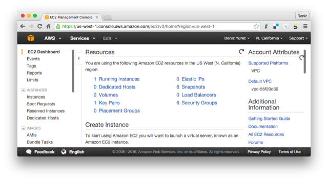
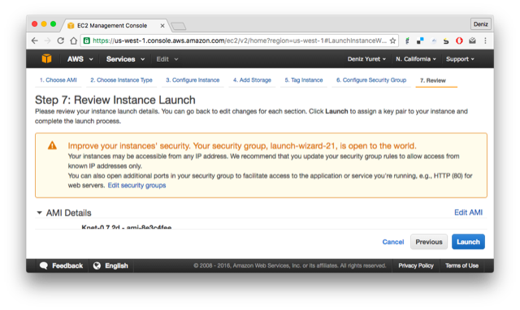

# Setting up Knet

Knet.jl is a deep learning package implemented in Julia, so you should
be able to run it on any machine that can run Julia. It has been
extensively tested on Linux machines with NVIDIA GPUs and CUDA
libraries, and it has been reported to work on OSX and Windows.  If
you would like to try it on your own computer, please follow the
instructions on [Installation](@ref). If you would like to try working
with a GPU and do not have access to one, take a look at [Using Amazon
AWS](@ref). If you find a bug, please open a [GitHub
issue](https://github.com/denizyuret/Knet.jl/issues). If you would
like to contribute to Knet, see [Tips for developers](@ref). If you
need help, or would like to request a feature, please use the
[knet-users](https://groups.google.com/forum/#!forum/knet-users)
mailing list.

## Installation

For best results install (1) a host compiler, (2) GPU support, (3)
Julia, and (4) Knet in that order.

Host compiler: On Linux, the gcc compiler that comes standard with all
distributions is supported.  On Mac you need to install
[Xcode](https://developer.apple.com/xcode/) which provides the clang
compiler.  On Windows you need the Visual C++ compiler which comes
with Visual Studio or Build Tools (I have tested with VS 2015 because
VS 2017 was not supported by the CUDA toolkit as of December 10,
2017).  If you don't have a compiler, most of Knet will still work on
CPU (slow) and without convolution support.

GPU support: If your machine has an NVIDIA GPU, Knet will
automatically discover it and compile support code if you have the
required host compiler,
[driver](http://www.nvidia.com/Download/index.aspx?lang=en-us),
[toolkit](https://developer.nvidia.com/cuda-downloads) and [cuDNN
library](https://developer.nvidia.com/cudnn) pre-installed.

Julia: Download and install the latest version of Julia from
[julialang.org](http://julialang.org/downloads). As of this writing
the latest version is 0.6.1 and I have tested Knet using 64-bit
Generic Linux binaries, the macOS package (10.8+ 64-bit dmg), and
64-bit Windows Self Extracting Archive (exe). 

Knet: Once Julia is installed, type `julia` at the command prompt to
start the Julia interpreter. To install Knet just use
`Pkg.add("Knet")`:

    $ julia
                   _
       _       _ _(_)_     |  A fresh approach to technical computing
      (_)     | (_) (_)    |  Documentation: https://docs.julialang.org
       _ _   _| |_  __ _   |  Type "?help" for help.
      | | | | | | |/ _` |  |
      | | |_| | | | (_| |  |  Version 0.6.1 (2017-10-24 22:15 UTC)
     _/ |\__'_|_|_|\__'_|  |  Official http://julialang.org/ release
    |__/                   |  x86_64-pc-linux-gnu

    julia> Pkg.add("Knet")

Some Knet examples use additional packages such as ArgParse, GZip and
JLD. These are not required by Knet, and are installed automatically
when needed. You can install any extra packages manually using
Pkg.add("PkgName").

To make sure everything has installed correctly, type
`Pkg.test("Knet")` which should take a minute kicking the tires. You
may need to run `Pkg.build("Knet")` to make sure the CUDA kernels are
up to date when using a GPU.  If all is OK, continue with the tutorial
section, if not you can get help at the
[knet-users](https://groups.google.com/forum/#!forum/knet-users)
mailing list.

### Installation problems

Sometimes when Knet or CUDA libraries are updated or moved, the
precompiled binaries get out of sync and you may get errors like:

    ccall: could not find function xxx in library libknet8.so

I recommend the following steps to refresh everything:

    shell> rm ~/.julia/lib/v0.5/*.ji
    shell> cd ~/.julia/v0.5/Knet/src
    shell> make clean; make
    shell> julia
    julia> Pkg.build("Knet")

This refreshes all precompiled binaries and should typically solve the
problem. If problems continue, you can get support from
[knet-users](https://groups.google.com/forum/#!forum/knet-users).

## Tips for developers

Knet is an open-source project and we are always open to new
contributions: bug fixes, new machine learning models and operators,
inspiring examples, benchmarking results are all welcome. If you'd
like to contribute to the code base, please sign up at the
[knet-dev](https://groups.google.com/forum/#!forum/knet-dev) mailing
list and follow these tips:

-   Please get an account at [github.com](https://www.github.com).
-   [Fork](https://help.github.com/articles/fork-a-repo) the [Knet
    repository](https://github.com/denizyuret/Knet.jl).
-   Point Julia to your fork using
    `Pkg.clone("git@github.com:your-username/Knet.jl.git")` and
    `Pkg.build("Knet")`. You may want to remove any old versions with
    `Pkg.rm("Knet")` first.
-   Make sure your [fork is
    up-to-date](https://help.github.com/articles/syncing-a-fork).
-   Retrieve the latest version of the master branch using
    `Pkg.checkout("Knet")`.
-   Implement your contribution.  This typically involves:
    - Writing your code.
    - Adding documentation under doc/src and a summary in NEWS.md.
    - Adding unit tests in the test directory and using `Pkg.test("Knet")`.
-   Please submit your contribution using a [pull
    request](https://help.github.com/articles/using-pull-requests).

## Using Amazon AWS

If you don't have access to a GPU machine, but would like to experiment
with one, [Amazon Web Services](https://aws.amazon.com) is a possible
solution. I have prepared a machine image
([AMI](http://docs.aws.amazon.com/AWSEC2/latest/UserGuide/AMIs.html))
with everything you need to run Knet. Here are step by step instructions
for launching a GPU instance with a Knet image:

1\. First, you need to sign up and create an account following the
instructions on [Setting Up with Amazon
EC2](https://docs.aws.amazon.com/AWSEC2/latest/UserGuide/get-set-up-for-amazon-ec2.html).
Once you have an account, open the [Amazon EC2
console](https://console.aws.amazon.com/ec2) and login. You should see
the following screen:

2\. Make sure you select the "N. California" region in the upper right
corner, then click on AMIs on the lower left menu. At the search box,
choose "Public images" and search for "Knet". Click on the latest Knet
image (Knet-0.8.1 as of this writing). You should see the following
screen with information about the Knet AMI. Click on the "Launch" button
on the upper left.

Note: Instead of "Launch", you may want to experiment with "[Spot
Request](https://aws.amazon.com/ec2/spot/pricing)" under "Actions" to
get a lower price. You may also qualify for an [educational
grant](https://aws.amazon.com/grants) if you are a student or
researcher.

3\. You should see the "Step 2: Choose an Instance Type" page. Next to
"Filter by:" change "All instance types" to "GPU instances". This should
reduce the number of instance types displayed to a few. Pick the
"g2.2xlarge" instance ("g2.8xlarge" has multiple GPUs and is more
expensive) and click on "Review and Launch".

4\. This should take you to the "Step 7: Review Instance Launch" page.
You can just click "Launch" here:

5\. You should see the "key pair" pop up menu. In order to login to your
instance, you need an ssh key pair. If you have created a pair during
the initial setup you can use it with "Choose an existing key pair".
Otherwise pick "Create a new key pair" from the pull down menu, enter a
name for it, and click "Download Key Pair". Make sure you keep the
downloaded file, we will use it to login. After making sure you have the
key file (it has a .pem extension), click "Launch Instances" on the
lower right.

6\. We have completed the request. You should see the "Launch Status"
page. Click on your instance id under "Your instances are launching":

7\. You should be taken to the "Instances" screen and see the address of
your instance where it says something like "Public DNS:
ec2-54-153-5-184.us-west-1.compute.amazonaws.com".

8\.  Open up a terminal (or Putty if you are on Windows) and type:

        ssh -i knetkey.pem ec2-user@ec2-54-153-5-184.us-west-1.compute.amazonaws.com

Replacing `knetkey.pem` with the path to your key file and
`ec2-54-153-5-184` with the address of your machine. If all goes well
you should get a shell prompt on your machine instance.

9\. There you can type `julia`, and at the julia prompt `Pkg.update()`
and `Pkg.build("Knet")` to get the latest versions of the packages, as
the versions in the AMI may be out of date:

    [ec2-user@ip-172-31-6-90 ~]$ julia
                   _
       _       _ _(_)_     |  A fresh approach to technical computing
      (_)     | (_) (_)    |  Documentation: http://docs.julialang.org
       _ _   _| |_  __ _   |  Type "?help" for help.
      | | | | | | |/ _` |  |
      | | |_| | | | (_| |  |  Version 0.4.2 (2015-12-06 21:47 UTC)
     _/ |\__'_|_|_|\__'_|  |  Official http://julialang.org/ release
    |__/                   |  x86_64-unknown-linux-gnu

    WARNING: Terminal not fully functional
    julia> Pkg.update()
    julia> Pkg.build("Knet")

Finally you can run `Pkg.test("Knet")` to make sure all is good. This
should take about a minute. If all tests pass, you are ready to work
with Knet:

    julia> Pkg.test("Knet")
    INFO: Testing Knet
    ...
    INFO: Knet tests passed

    julia> 
